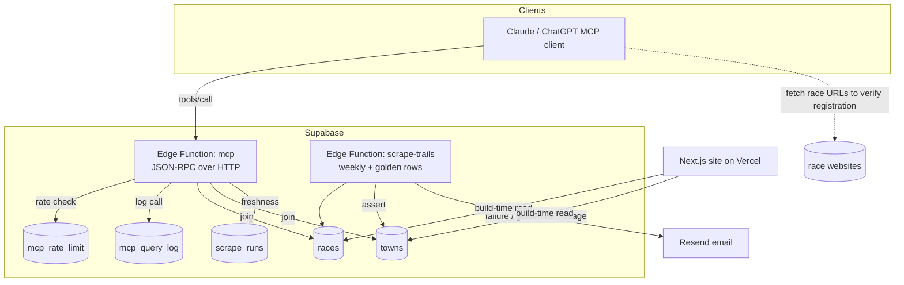

# feat: MCP race discovery server over live Supabase data

## Summary

Ship a public, no-auth MCP server as a Supabase Edge Function so people can plan Catalunya trail races by talking to their own Claude or ChatGPT. Three read-only tools (search, detail, what's-on) query the live `races` table joined to a new `towns` table for drive time from Plaça Glòries, and their descriptions direct the calling agent to fetch shortlisted race sites to verify registration and start time. Pipeline hygiene rides along: golden-row assertions, email alerts for failures, and a hashed-IP rate limiter. The site loses its dead chat widget and starts reading drive times from the `towns` table so there is one source of truth.

## Problem Frame

Picking a race today is a multi-tab loop: filter the calendar by elevation, then open each candidate's own site to check registration, sold-out status, confirmation, and start time, and judge the real drive from Barcelona (see origin: `docs/brainstorms/2026-06-20-mcp-race-discovery-requirements.md`). The maintainer's stated smallest proof is not richer stored data — it is being able to ask Claude, with this dataset as the backend, and have the agent do the click-through legwork. Shipping the agent surface first turns real planning sessions into the query log that will prioritise later enrichment.

Two facts from the codebase shape the work. Drive-time and geo data live only in committed JSON files (`data/towns-drive-times.json`, `data/towns-geocoded.json`) consumed by the Next.js build in `app/lib/races.js`; the `races` table has no lat/lng or drive columns, and a Deno Edge Function cannot import those JSON files. So the geo data must move into Postgres. Drive time is, and stays, measured from Plaça Glòries to each town — letting a user supply their own origin is a confirmed iteration-2 feature, not slice 1.

---

## Requirements

Carried from the origin doc; R-IDs preserved.

### MCP server and tools
- R1. A hosted MCP server exposes the live race dataset over a public URL using streamable HTTP, no authentication required.
- R2. A search tool filters races by drive time from Plaça Glòries, distance range, elevation range, month, province, and kids run, plus an explicit date or weekend window.
- R3. *(origin)* The search tool accepts an origin other than Plaça Glòries. **Deferred to iteration 2 per R20** — kept here so the requirement set is traceable.
- R4. Every tool response naming a race includes its official URL for live verification.
- R5. A detail tool returns one race's stored fields plus URL and the last-successful-scrape freshness timestamp.
- R6. A what's-on tool answers a date or weekend window using the same filters as search.
- R7. Tool descriptions instruct the agent to fetch each shortlisted race's site, verify registration status and start time before recommending, and report non-confirmation rather than guess.
- R8. Tool responses mark text relayed from scraped third-party sources as untrusted external content, carried in a delimited data field (never inlined into instruction text), with scraped free-text sanitised at scrape-ingestion time.
- R9. Tool responses state data freshness as an explicit age-in-days plus a `stale` boolean (tripped past a threshold, default 10 days), not only a timestamp, so the agent escalates caution on its own.
- R21. Every race in a tool response carries an explicit `registration_status: "unknown — verify at URL"` field, so an agent that ignores R7 still surfaces non-verification as data rather than presenting stored state as confirmed.

### Zero-cost guardrails
- R10. The server enforces per-IP rate limiting and response-size caps so a runaway caller cannot exhaust free-tier quota.
- R11. The deployment stays within free tiers; no configuration introduces a billable plan or payment method.
- R12. A usage alert notifies the maintainer when monthly invocations approach a set fraction of the free-tier ceiling. The counter increments on every JSON-RPC method (initialize, tools/list, tools/call), not only tools/call, so handshake traffic is not undercounted.

### Pipeline observation
- R13. A failed weekly scrape or tripped sanity gate notifies the maintainer.
- R14. After each scrape, golden-row assertions verify known-stable facts; a failed assertion notifies the maintainer through the same channel as a loud failure.

### Query logging
- R15. Every MCP tool call is logged with query text, filters, and tool name, without IP or any identity.
- R16. Query logs are purged after 90 days.
- R17. The server's public description discloses anonymous query logging.

### Website hygiene
- R18. The hosted AI chat widget is removed from the public website.
- R19. The website continues reading the live dataset, otherwise unchanged this slice.

### Slice-1 amendment (supersedes origin R3)
- R20. Drive time is always from Plaça Glòries, served from a `towns` table. The field is named `drive_minutes_from_barcelona` and the tool description states it is measured from Plaça Glòries, Barcelona — not from the user's location — so an agent never presents it as "distance from you." The origin's arbitrary-origin requirement (R3) is deferred to iteration 2, where the user supplies their own address.

---

## Key Technical Decisions

- **Geo data moves into a `towns` Postgres table.** ~150 rows (name, province, lat, lng, drive_minutes), backfilled from the two JSON caches. Both the MCP server and the site read it, so there is one source of truth. The Edge Function cannot import the JSON files, which forces this regardless.
- **Drive time is Plaça-Glòries-only in slice 1.** No origin parameter, no straight-line fallback, no Distance Matrix calls. Arbitrary origin is iteration 2 and becomes a small addition on top of this table.
- **Hand-implement the MCP JSON-RPC surface.** A stateless server returning plain `application/json` (no SSE, no session id) handling `initialize`, `notifications/initialized`, `tools/list`, `tools/call` is ~80 lines and matches the repo's raw `Deno.serve` / JSR style. Avoids the npm SDK + Hono dependency surface for three read-only tools. Pin protocol version `2025-03-26`.
- **Rate limiting via a Postgres counter, not Upstash.** A hashed-IP counter table purged hourly keeps the project on one platform with no new account. Real quota exhaustion is implausible at hobby scale; the counter's job is abuse protection and satisfying R10.
- **Query-log row count proxies invocation count for R12.** One log row per tool call is a good-enough monthly-usage signal without reading Supabase's own metrics; a daily `pg_cron` check alerts at the threshold.
- **Email via Resend free tier**, one channel for all alerts (loud failure, sanity trip, golden-row failure, usage threshold).
- **Reads use the anon key; writes use SECURITY DEFINER RPCs.** The MCP function reads `races`, `towns`, and `scrape_runs` via the anon key against explicit public-read RLS policies, and performs its two writes (query-log insert, rate-limit upsert) through `SECURITY DEFINER` Postgres functions. This resolves the access contradiction (anon cannot write service-role-only tables) without giving a public no-auth endpoint a service-role client — the function never holds the service-role key, so a logic bug cannot reach arbitrary tables. `verify_jwt=false`.
- **RLS is explicit on every table the endpoint can reach.** Public-read policies on `races`, `towns`, `scrape_runs` expose only intended columns; `mcp_query_log` and `mcp_rate_limit` have RLS enabled with no public-read policy (anon SELECT denied) — query text must never be publicly queryable.
- **Filter at the event level, not the row level.** `races` is one-row-per-distance; tools return grouped events. The function fetches all non-REMOVED rows, groups into events, then applies distance/elevation/drive/month filters at the event level (matching `app/lib/races.js`). Pushing distance/elevation predicates to PostgREST would drop sibling distance rows and return events with incomplete `distances[]`. At ~600 rows this all-rows fetch is well within the 2s CPU / 150s wall budget.
- **Scraped free-text is sanitised at ingestion** (scrape-trails), not just marked at read time: strip control/injection sequences before the row lands in `races`, and relay the text only inside a delimited data field. The R8 untrusted marker is necessary but not sufficient on its own (an LLM does not treat a JSON field as a trust boundary).
- **Grouping logic is re-implemented in the Edge Function**, not shared with `app/lib/races.js` (Next/npm-bound). The shared-core refactor is deferred (origin marks it slice-1-optional). A cross-check test asserts the two groupings produce identical event ids/counts on the same rows, guarding drift until they are unified.

---

## High-Level Technical Design

The agent does the live-verification leg itself (dashed): the MCP server returns the shortlist with URLs and freshness; the client fetches those race sites. The server never crawls.

---

## Implementation Units

### U1. `towns` table + backfill
- **Goal:** Move drive-time and geo data into Postgres as the single source of truth.
- **Requirements:** R20, R2 (drive filter), R11.
- **Dependencies:** none.
- **Files:** `supabase/migrations/<ts>_towns_table.sql`, `scripts/backfill-towns.mjs` (one-off loader reading the two JSON files), `data/towns-drive-times.json` (read), `data/towns-geocoded.json` (read).
- **Approach:** Create `public.towns` (`name` text PK, `province` text, `lat` numeric null, `lng` numeric null, `drive_minutes` int, `updated_at` timestamptz default now()). Enable RLS with a public-read policy. Backfill by unioning the keys of the two JSON files: drive-times has ~347 entries, geocoded ~113 (a subset), so the union is **~347 rows, of which ~234 have a drive time but no geocode** — the ~150 estimate was wrong. Insert geo-less rows with null lat/lng (preserving `drive_minutes` the site needs); never skip a drive-times row for lacking a geocode. `province` is in neither JSON file — source it from the `races` table (`DISTINCT town, province`), taking the most common province when a town spans more than one. Idempotent upsert on `name`.
- **Patterns to follow:** existing migrations in `supabase/migrations/`; RLS style from `20260424151934_scraper_schema.sql`.
- **Test scenarios:**
  - Backfill loads every distinct town across both JSON files; row count equals the size of the key union (~347, not ~150).
  - A town present only in drive-times (no geocode) inserts with null lat/lng and a non-null drive_minutes.
  - `province` is populated from the races table for every town that appears in races; a town absent from races keeps null province without failing.
  - Re-running the backfill changes no row counts and no values (idempotent).
  - `Covers R20.` Querying `towns` for "Peramola" returns its known drive_minutes.
- **Verification:** `towns` is populated (~347 rows) and selectable via the anon key; a spot-check town matches the JSON source and its province matches the races table.

### U2. MCP support tables — query log + rate limit
- **Goal:** Storage for anonymous query logging and the rate-limit counter, with retention.
- **Requirements:** R15, R16, R10.
- **Dependencies:** none.
- **Files:** `supabase/migrations/<ts>_mcp_support_tables.sql`.
- **Approach:** `mcp_query_log` (`id` bigint identity, `tool` text, `query_text` text, `filters` jsonb, `created_at` timestamptz default now()) — no IP, no identity column by construction. `mcp_rate_limit` (`ip_hash` text, `window_start` timestamptz, `count` int, primary key on `ip_hash`+`window_start`). Enable RLS on both with **no public-read policy** (anon SELECT denied — query text must never be publicly queryable). Provide two `SECURITY DEFINER` functions the anon role may execute: `log_mcp_call(tool, query_text, filters)` inserts a log row, and `bump_rate_limit(ip_hash, window_start)` upserts and returns the new count. These let the anon-key MCP function write without a service-role client and without a public write policy. Two `pg_cron` jobs: purge `mcp_query_log` older than 90 days daily; purge `mcp_rate_limit` rows older than the current window hourly. The rate-limit upsert is atomic (`insert … on conflict … do update set count = count + 1`) so concurrent Edge isolates can't race past the limit.
- **Patterns to follow:** `pg_cron` scheduling from `20260424162720_schedule_scrape.sql`; SECURITY DEFINER grant pattern.
- **Test scenarios:**
  - `mcp_query_log` has no column capable of storing IP or user identity.
  - Anon SELECT on `mcp_query_log` and `mcp_rate_limit` is denied by RLS; anon EXECUTE on the two SECURITY DEFINER functions succeeds.
  - The 90-day purge deletes a row dated 91 days ago and keeps one dated 89 days ago.
  - `Covers R16.` Retention job is registered in `cron.job`.
  - Hourly rate-limit purge removes a stale window row.
  - Concurrent `bump_rate_limit` calls for one ip_hash/window increment atomically (no lost updates).
- **Verification:** both tables exist with correct columns and RLS; the two functions are anon-executable; both cron jobs appear in `cron.job`.

### U3. Email-alert helper
- **Goal:** One reusable email path for all pipeline alerts.
- **Requirements:** R13, R14 (channel), R12 (channel).
- **Dependencies:** none.
- **Files:** `supabase/functions/_shared/email.ts`.
- **Approach:** A single `sendAlert(subject, body)` helper calling the Resend HTTP API with `RESEND_API_KEY` from function env. No-op with a logged warning when the key is absent so local runs don't fail. Plain-text body.
- **Patterns to follow:** env-var access and fetch style in `supabase/functions/scrape-trails/index.ts`.
- **Test scenarios:**
  - With no `RESEND_API_KEY`, `sendAlert` logs a warning and returns without throwing.
  - With a key, it issues one POST to the Resend endpoint with the subject and body.
  - A non-2xx Resend response is logged, not thrown (alerts must never crash the caller).
  - Test expectation: integration with the live Resend endpoint is verified manually once.
- **Verification:** a manual `sendAlert` test delivers an email to the maintainer address.

### U4. MCP server — protocol skeleton
- **Goal:** A stateless MCP endpoint speaking JSON-RPC over HTTP.
- **Requirements:** R1.
- **Dependencies:** none (tools land in U5).
- **Files:** `supabase/functions/mcp/index.ts`, `supabase/functions/mcp/protocol.ts`.
- **Approach:** `Deno.serve` handling POST: parse JSON-RPC, route `initialize` (return protocolVersion `2025-03-26`, `capabilities.tools`, serverInfo whose description carries the R17 logging disclosure), `notifications/initialized` (202, no body), `tools/list` (registry from U5), `tools/call` (dispatch), and `ping` (empty result). `tools/call` results use the MCP envelope — `result.content` as a `[{type:"text", text:...}]` array (plus `structuredContent` for the machine-readable payload), with `isError` for tool-level failures, distinct from top-level JSON-RPC `error` objects used for rate-limit rejection. If `initialize` requests a protocolVersion other than `2025-03-26`, respond with the supported version rather than hard-rejecting. Respond plain `application/json`; no SSE, no `Mcp-Session-Id`. CORS: `Access-Control-Allow-Origin: *`, allow `Content-Type`, handle `OPTIONS` with 204. GET returns 405. Block `null`/`file://` origins. Deploy with `verify_jwt=false`.
- **Patterns to follow:** `Deno.serve` request handling in `supabase/functions/scrape-trails/index.ts`.
- **Test scenarios:**
  - `Covers R1.` `initialize` returns protocolVersion `2025-03-26` and a tools capability.
  - `Covers R17.` `initialize` serverInfo description includes the anonymous-logging disclosure.
  - `initialize` with a different requested protocolVersion negotiates gracefully (returns the supported version), not a hard reject.
  - `tools/call` returns a `result.content` envelope with `isError` on tool-level failure, distinct from a JSON-RPC `error` on rate-limit rejection.
  - `notifications/initialized` returns 202 with no body; `ping` returns an empty result.
  - A malformed JSON body returns a JSON-RPC error, not a 500 crash.
  - `OPTIONS` preflight returns 204 with CORS headers; GET returns 405.
- **Verification:** an MCP client (Claude custom connector) completes the handshake and lists tools; re-verify against the ChatGPT remote-MCP client before slice 1 is considered done, since it is a named target.

### U5. MCP tools — search_races, get_race, whats_on
- **Goal:** The three read-only tools over `races` joined to `towns`.
- **Requirements:** R2, R4, R5, R6, R7, R8, R9, R20, R21.
- **Dependencies:** U1, U4.
- **Files:** `supabase/functions/mcp/tools.ts`, `supabase/functions/mcp/grouping.ts`, `supabase/functions/mcp/index.ts` (wire registry).
- **Approach:** Fetch all `races` rows (status != REMOVED) via the anon key, join `towns` by name for `drive_minutes_from_barcelona`, group into events with a Deno port of `app/lib/races.js` grouping (one event = `(race_url, town)`, distances[], kidsRun, soldOut), **then apply distance / elevation / drive / month / province filters at the event level** — never push distance/elevation predicates to PostgREST, which would drop sibling distance rows and corrupt `distances[]`. Month/date-window filters exclude null-date (TBD) races by construction; expose a `tbd_excluded_count` so the agent can tell the user the window result is not exhaustive. `search_races`: all R2 filters incl. drive max and a weekend/date window. `get_race`: one event by id with URL + freshness. `whats_on`: date/weekend window. Every response carries each race URL (R4); `drive_minutes_from_barcelona` (R20); a top-level `data_freshness` with age-in-days and a `stale` flag (R9); a per-race `registration_status: "unknown — verify at URL"` (R21); and scraped text only inside a delimited field marked `untrusted_external` (R8). Tool descriptions follow 2026 best practice: first sentence states verb + resource + return shape; an explicit instruction to fetch race URLs and verify registration/start time before recommending and to report non-confirmation (R7); a "does not include live registration status; drive time is from Plaça Glòries, Barcelona, not the user's location" disclaimer.
- **Patterns to follow:** grouping in `app/lib/races.js`; freshness query in its `getLastUpdated`.
- **Test scenarios:**
  - `Covers R2.` search with drive ≤ 60, elevation ≤ 1000, month filter returns only matching events, each with `drive_minutes_from_barcelona` from `towns`.
  - Event-level filtering: a race with 35km/24km/14km distances still shows all three when matched by a "30–50km" filter (no sibling-row loss).
  - `Covers R4.` every returned event includes its race URL.
  - `Covers R9.` each response includes `data_freshness` with age-in-days and a `stale` flag true past the threshold.
  - `Covers R21.` every race carries `registration_status: "unknown — verify at URL"`.
  - `Covers R5.` `get_race` returns one grouped event with distances[] and URL.
  - `Covers R6.` `whats_on` for a weekend returns only races in that window, with `tbd_excluded_count` reflecting null-date races held back.
  - Grouping: two distances of one race at one URL/town collapse to a single event with two distance entries.
  - A race whose town is missing from `towns` returns a null drive time rather than dropping the race.
  - `Covers R8.` scraped text appears only in a delimited field carrying the untrusted marker, never inlined into instruction text.
  - Tool description text contains the fetch-and-verify instruction (R7) and the Barcelona-origin disclaimer.
  - **Grouping cross-check:** the Deno grouping and `app/lib/races.js` grouping produce identical event ids and counts on the same row set.
- **Verification:** an agent query ("sub-60-min, sub-1000m next Saturday") returns a usable shortlist with URLs, freshness age, and per-race verify-at-URL status.

### U6. Rate limiting + query logging in tool calls
- **Goal:** Enforce R10 and capture R15 on every tool call.
- **Requirements:** R10, R12 (counter), R15.
- **Dependencies:** U2, U5.
- **Files:** `supabase/functions/mcp/index.ts`, `supabase/functions/mcp/ratelimit.ts`, `supabase/functions/mcp/log.ts`.
- **Approach:** Derive a per-IP key from the platform-appended (rightmost trusted) entry of `x-forwarded-for`, not the leftmost caller-supplied value, then sha-256 hash it (no raw IP stored); call `bump_rate_limit` (the U2 SECURITY DEFINER fn) to increment the current-window counter; over the threshold return a JSON-RPC error without querying data. Because `x-forwarded-for` is partly caller-controlled, also enforce a global (non-IP) daily invocation ceiling as a backstop against spoofed/distributed callers — both controls only need to hold the function inside the free tier. Increment the R12 invocation counter on **every** JSON-RPC method (initialize, tools/list, tools/call), since handshake calls consume Edge invocations too. Cap response size (truncate result lists to a max count, report `total_match_count` vs returned count so the agent knows the list is incomplete). Log each `tools/call` via `log_mcp_call` (the U2 SECURITY DEFINER fn) — tool, query text, filters — with no IP. (R17 disclosure lives in the U4 serverInfo description.)
- **Patterns to follow:** anon-key client usage; the SECURITY DEFINER RPCs from U2 (the function never holds a service-role key).
- **Test scenarios:**
  - `Covers R10.` calls beyond the per-window threshold from one IP hash get a rate-limit error; a different IP hash is unaffected.
  - The IP key is taken from the platform-trusted position, not the leftmost spoofable hop.
  - The global daily ceiling rejects further calls once crossed even when IPs vary.
  - No raw IP is written anywhere; only a hash appears in `mcp_rate_limit`, and only via the SECURITY DEFINER fn (no service-role client in the function).
  - `Covers R15.` a tool call writes one `mcp_query_log` row with tool, query text, filters, and no IP.
  - `Covers R12.` the invocation counter increments on initialize and tools/list, not only tools/call.
  - A result list larger than the cap is truncated and reports `total_match_count`.
- **Verification:** a burst from one client is throttled; `mcp_query_log` accrues identity-free rows; the invocation counter reflects handshake calls.

### U7. Golden-row assertions + alert wiring in scrape-trails
- **Goal:** Catch silent data corruption and route all pipeline alerts to email.
- **Requirements:** R13, R14, R12.
- **Dependencies:** U3.
- **Files:** `supabase/functions/scrape-trails/index.ts`, `supabase/functions/scrape-trails/golden.ts`, `supabase/migrations/<ts>_usage_alert_cron.sql`.
- **Approach:** After upsert, run a maintainer-chosen golden set (~6-8 large multi-distance races, asserting town/province and a known D+ for a known distance); on any failure call `sendAlert` and mark the run. The existing function does not yet call any alert path — add `sendAlert` calls at the sanity-gate throw (`index.ts` ~line 223) and in the catch block (~line 310) so loud failures and sanity-gate trips notify (R13); this is new wiring, not a pre-existing hook. Add a daily `pg_cron` job that reads the R12 invocation counter (incremented on all methods in U6, not the raw `mcp_query_log` row count) and alerts when above the configured fraction of the free-tier ceiling. Golden set is defined in `golden.ts` for review.
- **Patterns to follow:** sanity-gate and run-recording logic already in `supabase/functions/scrape-trails/index.ts`; cron style from `20260424162720_schedule_scrape.sql`.
- **Test scenarios:**
  - `Covers R14.` a golden assertion fails when a known race's D+ is wrong (simulated) and triggers an alert even though the row count is plausible.
  - All golden assertions pass on current good data; no alert fires.
  - `Covers R13.` a simulated scrape failure and a sanity-gate trip each call `sendAlert`.
  - `Covers R12.` the usage-alert job fires when the month's log-row count crosses the threshold and stays silent below it.
- **Verification:** corrupting a golden fact in a dry run produces an email; a clean run produces none.

### U8. Frontend — remove chat widget, clean up env
- **Goal:** Remove the dead chat and the secrets it left behind. The site's data layer is untouched this slice.
- **Requirements:** R18, R19.
- **Dependencies:** none (does not depend on U1 — the site keeps reading its JSON files).
- **Files:** `app/page.js`, `app/components/ChatWidget.jsx` (delete), `app/api/chat/route.js` (delete).
- **Scope note:** Decision resolved — the site keeps reading drive times from `data/towns-drive-times.json` / `data/towns-geocoded.json` this slice (origin R19, "otherwise unchanged"). Only the MCP server uses the `towns` table. Switching `app/lib/races.js` onto `towns` is deferred to slice 2, where it lands with the shared-core grouping refactor. `app/lib/races.js` is **not** edited here.
- **Approach:** Remove `ChatWidget` from `app/page.js`; delete `app/components/ChatWidget.jsx` and `app/api/chat/route.js`. After deletion, remove `ANTHROPIC_API_KEY` from the Vercel project env and rotate it at the provider (the deleted route used it), and remove `SUPABASE_SERVICE_ROLE_KEY` from the Vercel env (only the Edge Functions need it, never the Next build).
- **Patterns to follow:** current `app/page.js` component composition.
- **Test scenarios:**
  - `Covers R18.` the chat widget no longer renders and the chat API route is gone.
  - `Covers R19.` the site builds and renders the same race cards with drive times still sourced from the JSON files — no behavioural change.
  - `npm run build` succeeds.
  - After deletion, `ANTHROPIC_API_KEY` and `SUPABASE_SERVICE_ROLE_KEY` are absent from the Vercel project env; the Anthropic key is rotated.
- **Verification:** production build shows no chat widget; Vercel env no longer carries the two keys; race cards still show drive times.

---

## Scope Boundaries

### Deferred for later (from origin)
- Enrichment crawler and evidence/confidence model (slice 2, prioritised by the query log).
- Every.to-style "Ask in ChatGPT/Claude" handoff buttons; per-race pages; EN/CA/ES localization; iCal/alerts; midweek cadence; multi-source ingestion.
- **Arbitrary-origin drive time** (origin R3): iteration 2, user supplies their own address on top of the `towns` table.

### Outside this product's identity (from origin)
- User accounts, dashboards, monetization, organizer portals.
- Hosted, maintainer-funded AI chat on the website — users bring their own agent and tokens.
- Community correction/moderation flows.

### Deferred to follow-up work
- Shared-core refactor unifying the site's grouping (`app/lib/races.js`) and the MCP server's grouping (`supabase/functions/mcp/grouping.ts`) into one module. Slice 1 accepts the duplicated grouping routine.
- Migrating the site's data layer (`app/lib/races.js`) off the JSON files onto the `towns` table — deferred to slice 2 (decided), landing with the shared-core refactor above. Until then the site reads JSON and the MCP server reads `towns`; the backfill keeps them consistent.

---

## Risks & Dependencies

- **MCP spec / client churn.** Protocol pinned to `2025-03-26`; hand-rolled server limits exposure to SDK breakage. Re-verify against Claude's connector flow after deploy.
- **ChatGPT remote MCP is gated** to paid tiers with Developer Mode in 2026; Claude is the primary target. Setup docs should cover both and state the ChatGPT limitation.
- **Per-IP rate limiting aggregates CGNAT/corporate users** behind one counter — acceptable at hobby scale; revisit if false throttling appears.
- **`x-forwarded-for` is partly caller-controlled**, so per-IP limiting alone is bypassable; the global daily ceiling (U6) is the backstop, and the free-tier-pause posture caps the financial blast radius at zero.
- **Verification depends on agent compliance with R7**, a mechanism the cited research calls fragile and weaker on ChatGPT. Mitigated structurally: every race carries `registration_status: "unknown — verify at URL"` (R21) and a freshness age + `stale` flag (R9) so a non-compliant agent surfaces non-verification as data rather than presenting stored state as confirmed. A server-side fetch of the small shortlist remains a possible iteration-2 fallback if dogfooding shows agents skip the fetch.
- **New towns from future scrapes have no geo row** until added (same limitation as today's JSON); the MCP returns null drive time rather than dropping the race. A backfill/geocode step for new towns is out of slice-1 scope.
- **Resend free tier** is the email dependency; absence of the key degrades to logged warnings, never a crash.
- **Edge Function limits** (2s CPU, 150s wall, 500k invocations/month, pauses—never bills) are ample for a read-only filter over ~600 rows.

---

## Sources / Research

- Origin requirements: `docs/brainstorms/2026-06-20-mcp-race-discovery-requirements.md`.
- Existing pipeline and patterns: `supabase/functions/scrape-trails/index.ts`, `supabase/migrations/` (RLS, `pg_cron`).
- Site data layer to mirror and amend: `app/lib/races.js`.
- MCP Streamable HTTP transport, stateless plain-JSON responses, `WebStandardStreamableHTTPServerTransport` vs hand-rolled JSON-RPC: MCP spec 2025-03-26; Supabase "Bring Your Own MCP" guide.
- Rate limiting in stateless Edge Functions (in-memory Map unreliable across isolates; Postgres counter / Upstash): Supabase Edge Function architecture + rate-limiting examples.
- Adding remote MCP to Claude (custom connector / `mcp-remote`) and ChatGPT (paid + Developer Mode): Claude custom-connectors help, MCP connect-remote docs.
- Tool-description best practice (front-load verb/resource/return shape; follow-up instructions work, more reliably on Claude): arXiv 2602.14878 (Feb 2026), Merge.dev MCP tool-description guide.
- Supabase free-tier limits (500k invocations/month, pause-not-bill): Supabase functions limits docs.

---

## Open Questions

### Resolve during implementation
- Final golden-row set (U7) — pick from current data and confirm with the maintainer before deploy.
- Exact rate-limit threshold, global daily ceiling, and response-size cap values (set sensible defaults in U6; tune from the query log).
- The free-tier usage fraction that triggers the R12 alert (default ~50%, set conservatively so the proxy floors actual usage).
