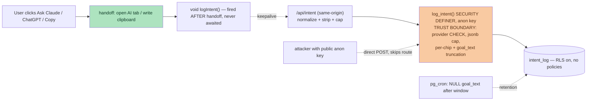

# feat: Ask-box intent logging — "log everything" (Step 3, U3)

Supersedes the U3 section of `docs/plans/2026-08-20-001-feat-best-next-race-onramp-plan.md` (that unit predates Dima's "log everything" decision and the crawler_hits-pattern discovery below). Everything else in that plan stands.

> **Build/review note — read `main`, not the shared working tree.** The parent plan's U1+U2 (goal box + intent chips + `buildBestNextRacePrompt`) are **SHIPPED on `main`** (commit `62a3fd4`): `app/components/AskAI.jsx` already holds `goal`/`chips`/`hasIntent` state and `INTENT_CHIPS = ['fun trail','somewhere new','chase a PB','kid-friendly']`; there is **no** separate `BestNextRace.jsx` — the capture lives in `AskAI.jsx`, which is the single ask-box surface. The repo's working directory is often checked out on another session's feature branch (e.g. `feat/card-quality-tier0`) where these do **not** exist — verify against `origin/main` or a `main` worktree. This is also the site's first `app/api/` route handler; consult `node_modules/next/dist/docs/01-app` for the Next 16 route-handler shape rather than training-data conventions (`AGENTS.md`: "This is NOT the Next.js you know").

---

## Summary

Capture **every** ask-box submission on trailraces.cat as a demand signal: the raw goal text typed, the intent chips picked, the filters active at submit, which provider button fired (Claude / ChatGPT / Copy), and a timestamp. This is the *why* half of the funnel — the dogfood proved agents pass structured filters but almost never say why, so `mcp_query_log` is blind to intent.

It is the site's **first browser-originated server-side write path** (the site is read-only-anon today). The **database is the trust boundary** — the insert-only RPC enforces every hard limit — because the write RPC is callable directly with the public anon key; the route handler in front of it is ergonomics for honest clients, not the security control. Raw free text can carry PII, so it is stored and labelled as *unlinked, user-volunteered content* (never "anonymous"), disclosed, and purged on retention while the anonymous aggregate is kept longer.

---

## Problem Frame

U1+U2 shipped (see build note above): the ask-box captures a goal + chips and hands a goal-conditioned prompt to the user's AI. But nothing is recorded, so we still can't see what runners want. At ~zero traffic the typed goals are the only real demand signal we have. We need to log them without (a) standing up the site's first write path in a way whose only guard is bypassable, or (b) pretending free text is anonymous when it can carry a name or a home town.

Two external-review findings from the parent work govern the design, and a doc-review of *this* plan (2026-08-25) sharpened both:
- **#7 (least-privilege ingest):** a public write must not use a broad service-role key; validate against an allowlist, cap the body, bound write volume, derive server-side fields server-side, and treat counts as directional. **Sharpened:** the RPC is granted to `anon` and thus directly callable with the public key, so the allowlist/caps must be enforced **in the RPC/table**, not only in the route handler (which a direct caller skips).
- **#8 (privacy):** raw goal text is user-volunteered content that may contain PII → store it but classify as *unlinked* (not "anonymous"), disclose it, escape it on output, purge it on retention, and keep no user identity. **Sharpened:** retention must not delete the anonymous aggregate the feature exists to build (NULL the text, keep the row), and the purge must be a scheduled DB job, not a manual step.

---

## Requirements

- **R1.** Log one row per ask-box submission — on **every** Ask-Claude / Ask-ChatGPT / Copy click, whether or not a goal/chips were entered (filter-only submissions are signal too). Advances the parent plan's R4.
- **R2.** Capture the full signal: `goal_text` (raw, capped), `chips[]` (stable chip ids), `filters` (active filter state), `provider` (claude | chatgpt | copy), `has_intent` (goal/chips present vs. filter-only), `created_at`. Nothing else.
- **R3.** No user identity in our store: no user IP, no user-agent, no cookies, no session id. (Precise: the row is not tied to an identity *in our systems*; transient edge/request logs outside our DB are out of our control — the disclosure says exactly this, not a blanket "anonymous.")
- **R4.** The write is **handoff-first and never awaited by the UI** — a log failure or latency must never delay or break the AI handoff or the clipboard copy. (Parent R5 stays: zero server-side training data; readiness/PB is client-side only.)
- **R5.** Least-privilege ingest (review #7): the **RPC/table is the trust boundary** and enforces provider-enum, body/field caps, and write-volume bounds; it runs `SECURITY DEFINER` insert-only, invoked with the **public anon key** — no service-role key, no new credential. The route handler is a first-line filter + normalizer for the site's own clients, explicitly not the security boundary.
- **R6.** Privacy-honest retention (review #8): `goal_text` is labelled unlinked user content, disclosed, output-escaped by any reader, and **NULLed on a scheduled purge** after a fixed window; the anonymous aggregate (chips/filters/provider/time) is retained longer. Free-text retention < aggregate retention, by construction.

---

## Key Technical Decisions

- **KTD1 — The DB is the trust boundary; the route handler is ergonomics.** `log_intent()` is granted to `anon`, and the anon key is public (`NEXT_PUBLIC_SUPABASE_ANON_KEY`, in the client bundle), so anyone can `POST ${SUPABASE_URL}/rest/v1/rpc/log_intent` directly and bypass the route handler's allowlist/caps/throttle. Therefore every hard limit lives **in the RPC/table**. The `crawler_hits` analogy holds only for the RPC *shape* (RLS-on/no-policies, SECURITY DEFINER, grant-to-anon, `left()` caps) — NOT for its safety story: `crawler_hits` is safe because it is written server-side from trusted middleware with only short capped scalars, whereas intent_log is browser-originated and carries free text + open jsonb. So intent_log must cap what `crawler_hits` never had to: jsonb size, per-chip length, and provider domain.
- **KTD2 — A normalizing route handler still earns its place (just not as the guard).** `app/api/intent/route.js` gives the site's own clients one call site, strips unknown chips/filter keys, recomputes `has_intent` server-side, caps the body, and is the **shared ingest contract** trackability T1's `/api/out` reuses. It is same-origin-only (no CORS headers → cross-origin JSON POST fails preflight; state this explicitly). It reduces junk on the honest path; it does not defend the boundary — the RPC does.
- **KTD3 — Store raw `goal_text`, but never call the row "anonymous".** Dima's call: log everything, including the raw sentence, because derived-tags-only loses the nuance. The honesty cost is paid explicitly (review #8): documented as unlinked user-volunteered content, disclosed, escaped on read, NULLed on retention, hard-capped (400 chars, in the RPC). See the premise tripwire in Success Criteria.
- **KTD4 — Write-volume is bounded in the DB, and the defense is stated honestly.** An in-memory route-handler throttle protects almost nothing (Vercel is multi-instance/ephemeral) and is fully bypassed by a direct RPC call, so it is **not** claimed as protection. The enforceable bound is DB-side: the RPC rejects an oversized `p_filters` and over-long chips, hard-caps `goal_text`, and (option, Open Question) enforces a coarse per-window insert ceiling; operationally, a Supabase row-count / storage alert is the backstop. Counts are directional and can be inflated by anyone with the public key — no dashboard may imply otherwise.
- **KTD5 — Retention NULLs the text and keeps the aggregate, via `pg_cron` in the migration.** `pg_cron` is already in use in this project (four `cron.schedule` migrations), and a plain `update ... set goal_text = null where created_at < now() - interval '<window>'` carries none of the "cron POSTs to a nonexistent endpoint" risk of the enrichment cron. Deleting whole rows would destroy the demand aggregate the feature exists to build — so purge **NULLs `goal_text`** and leaves the anonymous row. (Alternative shape, equivalent: free text in its own table with a shorter-retention cron; single-table-NULL is simpler for v1.)
- **KTD6 — One shared allowlist source, imported by both sides, with a parity test.** `INTENT_CHIPS` is today a local, non-exported array in `AskAI.jsx`, and the filter-key set is the shape of the `filters` prop. Hand-copying either into the validator means a later chip/filter addition is silently dropped → that dimension reads as false-zero demand, biasing the exact "what to build next" ranking the log exists to produce. So the chip set (as **stable ids**, not display labels, so a UI rename never fragments history) and the filter-key list live in one module both `AskAI.jsx` and the validator import, guarded by a test that fails when they diverge.

---

## High-Level Technical Design

The handoff (green) completes before logging starts and never awaits it. Both the honest route-handler path and a direct attacker call land on the same RPC — which is why the RPC, not the route, holds every limit.

---

## Implementation Units

### U1. `intent_log` table + `log_intent()` RPC + purge cron (migration)

**Goal:** The storage and the enforcing insert path — the trust boundary.
**Requirements:** R2, R3, R5, R6.
**Dependencies:** none.
**Files:** `supabase/migrations/<ts>_intent_log.sql` (new).
**Approach:** Mirror the *shape* of `supabase/migrations/20260820173000_crawler_hits.sql`, adding the caps `crawler_hits` never needed:
- Table `public.intent_log(id bigint identity pk, goal_text text, chips text[], filters jsonb, provider text, has_intent boolean, created_at timestamptz default now())`. No IP/UA/identity columns. `check (provider in ('claude','chatgpt','copy'))` at the table level (enforced even on the direct-RPC path). `comment on column intent_log.goal_text` recording the unlinked/user-volunteered/PII/retention classification.
- RLS **on**, **no policies** (no direct anon read or write).
- `log_intent(p_goal text, p_chips text[], p_filters jsonb, p_provider text, p_has_intent boolean)` — `SECURITY DEFINER`, `set search_path = public`. Inside: reject/normalize before insert — `left(p_goal, 400)`; truncate each chip element (`left(elem, 24)`) AND cap array length (≤ 8, comfortably above the 4-chip set); reject or coalesce `p_filters` when `pg_column_size(p_filters) > ~2 KB`; `p_provider` validated by the table CHECK (or a guard that maps unknown → reject). `revoke all ... from public; grant execute ... to anon`.
- `pg_cron` purge in the migration: schedule a daily `update public.intent_log set goal_text = null where goal_text is not null and created_at < now() - interval '180 days'` (window is an Open Question). NULLs text, keeps the aggregate row.
**Patterns to follow:** `20260820173000_crawler_hits.sql` (RLS-no-policy + SECURITY DEFINER + grant-to-anon + `left()` caps); the four existing `cron.schedule` migrations for the purge job shape.
**Test scenarios:**
- `log_intent(...)` inserts one row; `goal_text` > 400 chars truncated; each chip element > 24 chars truncated; chips array > 8 rejected/capped.
- `p_filters` over the size guard is rejected (or stored empty), not inserted unbounded.
- `provider` outside the enum is rejected by the CHECK — assert a direct `insert ... values (provider='junk')` fails.
- Direct `insert into intent_log` as `anon` is denied (RLS, no policy); direct `select` as `anon` is denied.
- `execute` on `log_intent` granted to `anon`, revoked from `public`.
- The purge job NULLs `goal_text` on rows older than the window and leaves `chips/filters/provider/created_at` intact (verify the aggregate survives).
- (Apply to a Supabase **branch** first, then remote, via the Supabase MCP; the `.sql` is the repo record.)

### U2. Shared allowlist source + `/api/intent` route handler

**Goal:** One source of truth for chips/filter-keys, and a same-origin normalizing endpoint that AWAITS the DB write.
**Requirements:** R1, R4, R5, KTD6.
**Dependencies:** U1.
**Files:** `app/lib/intent.js` (new — exports `INTENT_CHIPS` as stable `{id,label}[]`, the `FILTER_KEYS` allowlist, and a pure `normalizeIntentPayload()`), `app/lib/intent.test.mjs` (new), `app/api/intent/route.js` (new), `app/api/intent/route.test.mjs` (new).
**Approach:** `app/lib/intent.js` is the shared source (KTD6). `normalizeIntentPayload(body)` drops chips whose id isn't in `INTENT_CHIPS`, keeps only `FILTER_KEYS` from `filters`, validates `provider` against the enum, trims/caps `goal_text`, and **recomputes `has_intent` server-side** (never trusts the client boolean). The route handler (`POST` only, same-origin — no CORS headers, so cross-origin preflight fails by default; state this) reads the JSON body with a total-size cap (reject > 4 KB), calls `normalizeIntentPayload`, then **`await`s** the `fetch` to `${SUPABASE_URL}/rest/v1/rpc/log_intent` with the anon key (mirroring `middleware.js`'s header shape) before returning `204`. Awaiting is required: a non-awaited fetch can be killed when the serverless function freezes (or use `after()` from `next/server`, confirmed available in this build). The client's `keepalive` already makes route-handler latency invisible to the user, so awaiting costs nothing user-visible. Never leak validation detail; return `204` regardless.
**Patterns to follow:** `middleware.js` (`fetch` to `/rest/v1/rpc/log_crawler_hit` with `apikey`/`Authorization` anon headers); `supabase/functions/mcp/log_filter.ts` (undeclared keys dropped); `node_modules/next/dist/docs/01-app` for the route-handler signature (first route handler in this repo).
**Test scenarios:**
- `normalizeIntentPayload`: unknown chip ids and unknown filter keys are dropped; `provider` not in enum → rejected; `goal_text` over cap truncated; `has_intent` recomputed (client `true` + empty goal/chips → `false`).
- Parity test (KTD6): the validator's chip-id set and filter-key list equal `INTENT_CHIPS`/`FILTER_KEYS` from `app/lib/intent.js` — fails if they drift.
- Route handler: body over 4 KB rejected before RPC; valid body triggers exactly one awaited RPC call; the handler returns 204 even when the RPC fetch rejects (R4) and never throws to the caller.
- Assert the RPC payload has no identity fields (no IP/UA read into it).

### U3. Client wiring in `AskAI.jsx` — handoff-first, never awaited

**Goal:** Log every submit without ever touching the handoff, using the shared source.
**Requirements:** R1, R4, KTD6.
**Dependencies:** U2.
**Files:** `app/components/AskAI.jsx` (modify), `app/components/askPrompt.test.mjs` or a small `app/lib/intent.test.mjs` case for the payload builder (component-test harness may not exist; cover the payload shape as a pure helper in `app/lib/intent.js`).
**Approach:** Replace the local `INTENT_CHIPS` array with an import from `app/lib/intent.js` (KTD6) — the chips render from `{id,label}` (label shown, id logged). Add a single `logIntent({goal, chips, filters, provider})` helper (in `app/lib/intent.js`) that does a void, never-awaited `fetch('/api/intent', {method:'POST', keepalive:true, body: ...})` wrapped in a swallow-all `catch`. In `open()` and `copy()`, call `logIntent(...)` on the line **strictly after** `window.open(...)` / `navigator.clipboard.writeText(...)` — never before, never awaited (an `await` before the clipboard write can consume the user-activation and silently break Copy). `provider` is `claude|chatgpt|copy` per the button. `chips` logged as ids.
**Patterns to follow:** the existing non-blocking `copy()` structure; `keepalive` fire-and-forget.
**Test scenarios:**
- Ask Claude fires exactly one `/api/intent` POST with `provider:'claude'` and current goal/chip-ids/filters; the AI tab still opens.
- Ordering: `window.open` / clipboard write is invoked **before** the intent fetch is initiated (assert call order) — the handoff-first guarantee, not just "doesn't block".
- Copy still writes the clipboard even when the intent POST rejects; user still sees "✓ Copied" truthfully.
- Filter-only submit (no goal, no chips) still logs with `has_intent:false` (R1).
- The prompt-building path (parent U2) is unchanged — logging is additive.

### U4. Disclosure + retention, made real and guarded

**Goal:** The #8 privacy posture is visible and can't silently regress.
**Requirements:** R3, R6.
**Dependencies:** U1.
**Files:** the disclosure surface alongside the existing query-log anonymity note — `app/for-agents/page.js` and/or `app/about/page.js`; a render assertion in that page's test if one exists, else a `public/llms.txt` / doc note; `AGENTS.md` deployment-state; retention op in `docs/open-loops.md`.
**Approach:** One honest line where logging is disclosed: we record what people type into the ask-box to learn what runners want; it is **not tied to any identity in our systems**, but because it is free text you typed, treat it as user-volunteered content; the text is deleted after N days while anonymous counts are kept. Record the retention window + that the purge is a scheduled `pg_cron` job (U1), not a manual step.
**Test scenarios:** if the disclosure lives in a testable component, assert the disclosure string and the retention window render (guards against a silent copy-refactor drop); otherwise `Test expectation: none — doc/copy` and verify on the live page.

---

## Scope Boundaries

**In scope:** logging every ask-box submission from `AskAI.jsx` (the single ask-box surface) — raw goal + chip ids + filters + provider; the shared allowlist source; the normalizing route handler; the enforcing migration + RPC + purge cron; disclosure + retention.

**Deferred to Follow-Up Work:**
- Trackability **T1** (`/api/out` outbound-click beacon) — reuses this exact route-handler + RPC ingest contract; build next per `docs/seo/2026-08-24-trackability-requirements.md`.
- A **durable, cross-instance** rate-limit (KV/Upstash or a DB per-window ceiling beyond the coarse guard) — v1's enforceable bound is the RPC caps + retention + a storage alert (KTD4).
- Any **reading/aggregation UI** for the log — reads via SQL / the tracker ritual for now. (Whoever builds it inherits the output-escaping obligation on `goal_text`.)
- Server-side **derived categories** from `goal_text` (tagging) — raw text is logged; categorization is a later analysis step.

**Outside this product's identity:** accounts, per-user history, anything linking a row to a person. The log stays unlinked by design.

---

## Success Criteria

- Every ask-box submission produces exactly one `intent_log` row; the handoff is never delayed or broken by logging (R1, R4).
- No user identity is stored; `anon` cannot read or directly write the table; the RPC rejects out-of-enum provider, oversized filters, and over-long chips **on the direct path** (R3, R5).
- The disclosure line is live, and the `pg_cron` purge is scheduled in the migration and observed to NULL `goal_text` while keeping the aggregate (R6).
- Within a few weeks of real traffic, the log answers "what are people actually asking for?" well enough to rank one Slice-2 taste field or one race to enrich (read as directional; mark dogfood dates per trackability T6).
- **Premise tripwire (adversarial guardrail):** if, by the end of the first learning window, the raw `goal_text` has not changed a single build/enrich decision beyond what the chips + filters already showed, retire `goal_text` logging and keep chips + filters only. This caps the downside of the log-everything bet without pre-empting it.

---

## Risks & Dependencies

- **First browser-originated write path, public-key-callable.** The route handler is bypassable, so security lives in the RPC/table (KTD1). The plan must not regress to "the endpoint validates it."
- **Free-text PII.** Accepted deliberately (Dima's "log everything") and paid for honestly: unlinked classification, disclosure, output-escaping obligation on any reader, hard truncation, scheduled NULL-purge. Any later reader/UI (T1, aggregation, tagging) inherits the escape obligation.
- **Write-volume / cost.** Bounded by RPC caps + retention; a Supabase row-count/storage alert is the operational backstop. Counts are directional — never presented as bot-clean.
- **Allowlist drift** silently biases the learning signal — mitigated by the shared source + parity test (KTD6) and stable chip ids.
- **Infra steps are Dima's:** apply the migration (Supabase MCP, branch first), then the front-end ships on Vercel push. No new env var. No MCP redeploy (if one sneaks in, the `deploy-mcp.sh` gate + honesty rules in `AGENTS.md` apply).

---

## Open Questions

- Retention window: 180 days proposed for `goal_text` NULL-purge — confirm. (Aggregate is kept indefinitely unless you set a separate window.)
- Coarse per-window insert ceiling inside `log_intent()` — worth adding in v1, or rely on RPC caps + retention + a storage alert (KTD4)?
- Disclosure placement — `/for-agents`, `/about`, or both — beside the existing query-log anonymity note.
