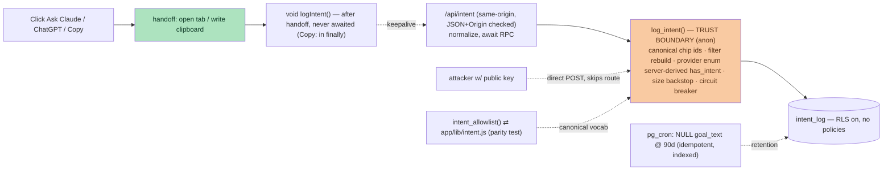

# feat: Ask-box intent logging — "log everything" (Step 3, U3)

> **Build/review note — read `main`, not the shared working tree.** The parent plan's U1+U2 (goal box + intent chips + `buildBestNextRacePrompt`) are **SHIPPED on `main`** (commit `62a3fd4`): `app/components/AskAI.jsx` holds `goal`/`chips`/`hasIntent` state and `INTENT_CHIPS = ['fun trail','somewhere new','chase a PB','kid-friendly']`; there is **no** separate `BestNextRace.jsx` — capture lives in `AskAI.jsx`, the single ask-box surface. The working directory is often on another session's feature branch where these do not exist — verify against `origin/main`. This is also the repo's first `app/api/` route handler; consult `node_modules/next/dist/docs/01-app` for the Next 16 route-handler shape.

## Supersession (what in the parent this overturns)

This plan **replaces** the parent plan's intent-logging design. It does not merely add to it. Superseded, explicitly (Codex review 2026-08-25, #4):

- **Parent R4** (derived goal category by default; raw text only "if kept") → **raw `goal_text` is logged by default** (Dima: "log everything"), paid for with the privacy posture in R6.
- **Parent KTD3** (route handler holds a **write credential**; the route is the boundary) → **credential-free**: the write RPC stays `anon`-callable, so the **RPC is the trust boundary** and the route handler is a normalizer, not the guard (Dima's decision 2026-08-25, after Codex flagged the credential trade-off).
- **Parent U3** and its stored-field/rate-control contract → replaced by U1–U4 below.

A one-line pointer has been added to the parent's R4/KTD3 so the parent is no longer authoritative for logging.

---

## Summary

Log **every** ask-box submission (raw goal text + chip ids + active filters + provider button + timestamp) as the "why" demand signal `mcp_query_log` is blind to. It is the site's first browser-originated write path (read-only-anon today).

**Trust model (credential-free, Dima's choice):** the write RPC is `anon`-callable — so the **RPC itself is the trust boundary** and does full *semantic* validation (canonical chip ids, filter rebuild from allowed keys+domains, provider enum, server-derived `has_intent`), plus a byte-size backstop and an atomic write-volume circuit breaker. The dataset is classified as an **untrusted, directional hint — not decision-grade**: a determined actor with the public key can still submit many valid-looking rows up to the circuit-breaker ceiling, so counts inform priorities but never settle them. Raw text is *unlinked structured event data* (not "anonymous"), disclosed beside the box, and NULL-purged at 90 days.

---

## Problem Frame

U1+U2 shipped: the ask-box captures a goal + chips and hands a goal-conditioned prompt to the user's AI. Nothing is recorded, so we can't see what runners want. The typed goals are the only real demand signal at ~zero traffic. The design must (a) not stand up a public write whose only guard is bypassable, and (b) not call free text "anonymous."

Governing review findings (parent review #7/#8, sharpened by Codex on this plan, 2026-08-25):
- **Least-privilege / integrity:** because the RPC is `anon`-callable, size caps alone don't stop a direct caller poisoning fields or inflating volume. The RPC must validate *meaning*, and write-volume must be bounded *in the DB*, not merely claimed.
- **Privacy:** after the text is NULLed, each exact-time row still holds chips/filters/provider/`has_intent` — that is **unlinked row-level event data**, not an aggregate, and rare combinations could correlate with external logs. So: an inline notice by the input, honest classification and deletion wording, and admin-only raw-text reads.
- **Delivery honesty:** best-effort browser logging can persist zero rows; the contract is "one best-effort attempt per click; data may undercount," not "exactly one row."

---

## Requirements

- **R1.** Fire **exactly one best-effort logging attempt** per eligible click (Ask-Claude / Ask-ChatGPT / Copy), whether or not a goal/chips were entered. Persisted rows **may undercount** (network loss, page termination) — that is acceptable and stated, not a guarantee of one stored row.
- **R2.** Capture: `goal_text` (raw, capped), `chips[]` (canonical stable ids), `filters` (rebuilt from the canonical filter model, values in-domain), `provider` (claude | chatgpt | copy), `has_intent` (server-derived), `created_at`.
- **R3.** No user identity in our store: no user IP, UA, cookies, or session id. The disclosure says "not tied to any identity **in our systems**" — it does not claim deletion from backups/PITR/edge/request logs we don't control.
- **R4.** Handoff-first: the logging attempt runs **after** the handoff (tab open / clipboard) and is **never awaited** by the UI; for Copy it runs in a `finally` so a rejected clipboard write still logs. A log failure never delays or breaks the handoff.
- **R5.** The **RPC is the trust boundary** (credential-free): `SECURITY DEFINER`, `anon`-executable, it *semantically* validates and normalizes every field and enforces an atomic write-volume ceiling. The route handler is a same-origin normalizer for the site's own clients — helpful, not the guard.
- **R6.** Privacy: `goal_text` is **unlinked structured event data** (not "anonymous"), read by project-admins only, output-escaped by any reader, disclosed **beside the input** (`aria-describedby`), and **NULLed at 90 days** by a scheduled DB job; the anonymous chips/filters/provider/time row is retained longer. The dataset is labelled directional-not-decision-grade wherever it is read.

---

## Key Technical Decisions

- **KTD1 — The RPC validates *meaning*, not just size (Codex #1).** Because a direct `anon` caller bypasses the route handler, `log_intent()` itself: keeps only chip ids present in the canonical allowlist (dropping the rest); rebuilds `filters` from the canonical filter keys and their value domains (so an arbitrary jsonb blob can't land); dedupes + caps arrays; rejects a null/invalid `provider`; and **derives `has_intent`** from the normalized goal+chips (never trusts a client boolean). `left()`/`pg_column_size` are byte backstops beneath this, not the validation.
- **KTD2 — One canonical vocabulary, mirrored JS↔SQL, parity-tested.** The chip ids, filter keys, and filter value domains live once in `app/lib/intent.js` (source for the UI + route handler) and are mirrored in the RPC. A companion read-only SQL function `intent_allowlist()` returns the SQL-side sets; a parity test asserts they equal the JS sets — the same parity-guard pattern the repo already uses for `difficulty.ts`↔`format.js`. This is why chips are **stable ids**, not display labels: a UI rename must never fragment history or silently zero a dimension (Codex #6). The filter schema derives from the existing canonical filter model (`app/lib/filters.js` `DEFAULT_FILTERS` + value domains), not a second hand-listed keys-only set.
- **KTD3 — Credential-free, so write-volume is bounded by an atomic DB circuit breaker + honest classification (Codex #2; Dima's choice).** No new credential; `anon` keeps execute. The RPC enforces an atomic global ceiling (e.g. reject when inserts in the trailing window exceed a threshold) to bound cost/volume. This does **not** stop one caller dominating the signal within the ceiling — so the dataset is explicitly **directional, not decision-grade**, everywhere it is read. A Supabase row-count/storage alert is the operational backstop. (If this signal ever must be decision-grade, the upgrade is: revoke `anon` execute and write via a narrow server credential — parent KTD3's path — reopened only if needed.)
- **KTD4 — Retention NULLs the text at 90 days, keeps the row, via idempotent `pg_cron` (Codex #3, secondary).** `update ... set goal_text = null where goal_text is not null and created_at < now() - interval '90 days'`, scheduled idempotently (unschedule-if-exists then schedule), with a partial index on `created_at where goal_text is not null` for the purge predicate. Deleting whole rows would destroy the demand aggregate. Verify by an aged test row going NULL + the named job's run history — not migration success alone.
- **KTD5 — The route handler is a same-origin normalizer, and it AWAITs the RPC (Codex #5, secondary).** `app/api/intent/route.js` strips unknown chips/filter keys, recomputes `has_intent`, caps the body (>4 KB rejected), **enforces JSON content-type + an Origin check** (not relying on "no CORS ⇒ same-origin"), then **awaits** the `fetch` to the RPC before returning `204` (a non-awaited serverless fetch can be killed mid-flight; or use `after()` from `next/server`). It reduces junk on the honest path; the RPC is still the boundary.

---

## High-Level Technical Design

Both the honest route path and a direct attacker call land on the RPC — which is why the RPC holds all validation and the volume ceiling.

---

## Implementation Units

### U1. `intent_log` table + validating `log_intent()` RPC + `intent_allowlist()` + purge cron (migration)

**Goal:** Storage + the semantically-validating, volume-bounded insert path — the trust boundary.
**Requirements:** R2, R3, R5, R6, KTD1–KTD4.
**Dependencies:** none (but the canonical sets must equal `app/lib/intent.js` — U2/KTD2).
**Files:** `supabase/migrations/<ts>_intent_log.sql` (new).
**Approach:** shape from `supabase/migrations/20260820173000_crawler_hits.sql`, plus semantic validation and the ceiling `crawler_hits` never needed:
- Table `intent_log(id bigint identity pk, goal_text text, chips text[], filters jsonb, provider text, has_intent boolean, created_at timestamptz default now())`; `check (provider in ('claude','chatgpt','copy'))`; column comment recording the unlinked/PII/90-day/admin-read classification. RLS **on**, **no policies**. Partial index `on intent_log(created_at) where goal_text is not null` (purge predicate).
- `intent_allowlist()` — read-only SQL function returning the canonical chip ids + filter keys + value domains as jsonb (the SQL side of KTD2's parity).
- `log_intent(p_goal, p_chips, p_filters, p_provider, p_has_intent)` — `SECURITY DEFINER`, `set search_path = public`. Inside, in order: keep only chip ids ∈ allowlist, dedupe, cap ≤ 8, `left(elem,24)`; rebuild `filters` to only canonical keys with in-domain values (drop the rest), reject when `pg_column_size` still exceeds ~2 KB; require valid non-null `p_provider`; `left(p_goal,400)`; **derive `has_intent`** = (normalized goal non-empty OR chips non-empty), ignoring the client value; enforce the atomic write-volume ceiling (reject/no-op when trailing-window count exceeds the threshold); then insert. `revoke all from public; grant execute to anon`.
- `pg_cron` purge (KTD4): idempotent schedule of the 90-day NULL-update.
**Patterns to follow:** `20260820173000_crawler_hits.sql`; the four existing `cron.schedule` migrations; `supabase/functions/mcp/log_filter.ts` (drop-undeclared discipline, now in SQL).
**Test scenarios (call the RPC directly as `anon` — the real attacker path):**
- Junk chip ids are dropped; only allowlisted ids persist; duplicates collapse; > 8 capped; over-long element truncated.
- `filters` with unknown keys / out-of-domain values is rebuilt to only valid pairs; an oversized jsonb blob is rejected.
- `provider` null or not-in-enum → rejected (RPC + table CHECK).
- `has_intent` is server-derived: client `true` with empty normalized goal+chips → stored `false`.
- `goal_text` > 400 truncated.
- Write-volume ceiling: bursting past the threshold in the window stops persisting further rows (assert the atomic behavior, no partial/over-count).
- Direct `insert`/`select` as `anon` denied (RLS). `execute` on `log_intent`/`intent_allowlist` granted to `anon`, revoked from `public`.
- Purge NULLs `goal_text` on aged rows, leaves chips/filters/provider/created_at intact; the named cron job exists and its run history shows the update.

### U2. Canonical vocab source + `/api/intent` normalizing route handler

**Goal:** One JS source of truth (parity-tested vs SQL) + a same-origin normalizer that awaits the DB.
**Requirements:** R1, R4, R5, KTD2, KTD5.
**Dependencies:** U1.
**Files:** `app/lib/intent.js` (new — `INTENT_CHIPS` as stable `{id,label}[]`, the canonical filter keys+domains **imported/derived from `app/lib/filters.js`**, `normalizeIntentPayload()`, and the `logIntent()` client helper), `app/lib/intent.test.mjs` (new, incl. the JS↔SQL parity test against `intent_allowlist()`), `app/api/intent/route.js` (new), `app/api/intent/route.test.mjs` (new).
**Approach:** `normalizeIntentPayload(body)` drops non-allowlisted chip ids, rebuilds `filters` from the canonical model + domains, validates `provider`, trims/caps `goal_text`, recomputes `has_intent`. The route (`POST`, same-origin: require `content-type: application/json` and an allowed `Origin`, reject otherwise; body > 4 KB rejected) calls it, then **awaits** the `fetch` to `/rest/v1/rpc/log_intent` (anon headers per `middleware.js`) before `204`. Never leaks validation detail.
**Patterns to follow:** `middleware.js` anon-RPC fetch; `app/lib/filters.js` for the canonical filter model; `node_modules/next/dist/docs/01-app` for the handler signature.
**Test scenarios:**
- `normalizeIntentPayload`: unknown chip ids / filter keys / out-of-domain values dropped; provider enum enforced; `goal_text` capped; `has_intent` recomputed.
- **Parity test (KTD2):** JS chip ids + filter keys/domains equal what `intent_allowlist()` returns — fails on drift.
- Route: non-JSON content-type or disallowed Origin → rejected; body > 4 KB → rejected; valid body → exactly one **awaited** RPC call; returns 204 even when the RPC rejects (R4); never throws to the caller; RPC payload carries no identity fields.

### U3. Client wiring in `AskAI.jsx` — handoff-first, ids to log, labels to prompt

**Goal:** Log every submit without touching the handoff; don't degrade the shipped prompt.
**Requirements:** R1, R4, KTD2, Codex #6.
**Dependencies:** U2.
**Files:** `app/components/AskAI.jsx` (modify), `app/components/askPrompt.js` (modify — chip label mapping), plus test coverage of the id↔label split in `app/lib/intent.test.mjs` / `app/components/askPrompt.test.mjs`.
**Approach:** State holds selected chip **ids**; the UI renders `{label}` and `buildBestNextRacePrompt` receives **labels** (map ids→labels) so the prompt still reads "chase a PB", not `chase_pb`; **logging receives ids**. Replace the local `INTENT_CHIPS` array with the import from `app/lib/intent.js`. In `open()`, call the never-awaited `logIntent(...)` on the line **after** `window.open`; in `copy()`, call it in a **`finally`** after the clipboard attempt (so a rejected clipboard write still logs). `keepalive:true`, swallow-all catch.
**Patterns to follow:** the existing non-blocking `copy()`; `keepalive` fire-and-forget.
**Test scenarios:**
- Two independent assertions (Codex #6): the AI prompt contains the chip **label** ("chase a PB"); the logged payload contains the chip **id** ("chase_pb"). Neither leaks into the other.
- Ordering: `window.open` / clipboard write happens **before** the intent fetch is initiated.
- Copy logs even when the clipboard write rejects (the `finally` path), and the user still sees a truthful "✓ Copied" only when the write actually succeeded.
- Filter-only submit logs with `has_intent:false`.
- One best-effort attempt per click (R1) — not a guarantee of one persisted row.

### U4. Disclosure (beside the box) + retention, guarded

**Goal:** The #8 posture is visible where people type and can't silently regress.
**Requirements:** R3, R6.
**Dependencies:** U1.
**Files:** `app/components/AskAI.jsx` (an inline notice tied to the goal input via `aria-describedby`), plus the existing data/logging note on `app/for-agents/page.js` / `app/about/page.js`; `AGENTS.md`; retention op in `docs/open-loops.md`.
**Approach:** A concise notice **beside the input**: "What you type is saved to learn what runners want — not tied to your identity in our systems, kept 90 days, then the text is deleted." Longer form on /for-agents or /about. Classify as *unlinked structured event data*; raw text is project-admin-read-only; wording does not claim deletion from backups/PITR/edge logs we don't control.
**Test scenarios:** assert the inline notice renders and is linked to the input via `aria-describedby`; assert the retention window string renders (guards a silent copy-refactor drop).

---

## Scope Boundaries

**In scope:** logging every `AskAI.jsx` submission (raw goal + chip ids + filters + provider); the canonical vocab source + parity; the semantically-validating RPC + circuit breaker + purge cron; the normalizing route handler; the inline disclosure + retention.

**Deferred to Follow-Up Work:**
- Trackability **T1** (`/api/out`) — reuses this ingest contract; separate build.
- **Decision-grade upgrade** (revoke `anon` execute + narrow server credential) — only if the directional signal proves insufficient (KTD3).
- A **bounded derived category before purge** — after 90 days a text-only row keeps only "had intent"; if long-lived *semantic* demand matters, derive a coarse category at purge time. v1 admits only chip/filter + had-intent survives long term (Codex secondary).
- Reading/aggregation UI (inherits the output-escape + directional-only obligations).

**Outside this product's identity:** accounts, per-user history, linking a row to a person.

---

## Success Criteria

- One best-effort logging attempt per eligible click; the handoff is never delayed or broken (R1, R4).
- A direct `anon` RPC call with junk chips / out-of-domain filters / forged `has_intent` / null provider is normalized or rejected — not persisted as poison (R5, KTD1); the write-volume ceiling holds atomically (KTD3).
- No user identity stored; `anon` can't read or directly insert; the `pg_cron` purge is observed to NULL aged `goal_text` while the aggregate survives (R3, R6).
- The inline disclosure renders beside the box; the dataset is labelled directional-not-decision-grade wherever read.
- **Premise tripwire (tightened, Codex secondary):** set a review date (first run: +6 weeks) and a minimum non-dogfood sample (e.g. ≥ 50 real submissions). Retire `goal_text` logging (keep chips + filters) unless the raw text has surfaced a **recurring** unmet-intent pattern that chips+filters missed — not a single anecdote.

---

## Risks & Dependencies

- **Public write path, RPC-guarded.** Security lives in the RPC (KTD1/KTD3); the plan must not regress to "the endpoint validates it."
- **Signal integrity is bounded, not guaranteed.** A determined caller can inflate valid-looking rows up to the ceiling → the data is a directional hint. Every reader/label must say so. Upgrade path (credential) is documented, not built.
- **Free-text PII.** Unlinked classification, inline disclosure, admin-only reads, output-escape obligation on any reader, 90-day NULL-purge; deletion wording honest about backups/PITR/logs.
- **JS↔SQL vocab drift** silently biases the signal → parity test (KTD2).
- **Infra is Dima's:** apply the migration (Supabase MCP, a branch first), then the front-end ships on Vercel push. No new env var, no MCP redeploy.

---

## Open Questions

- Circuit-breaker threshold + window (e.g. N inserts / minute globally) — pick a value that never blocks real use at current traffic but caps a runaway.
- Whether to derive a bounded category at purge time now, or accept chip/filter-only long-term (Scope: deferred by default).
