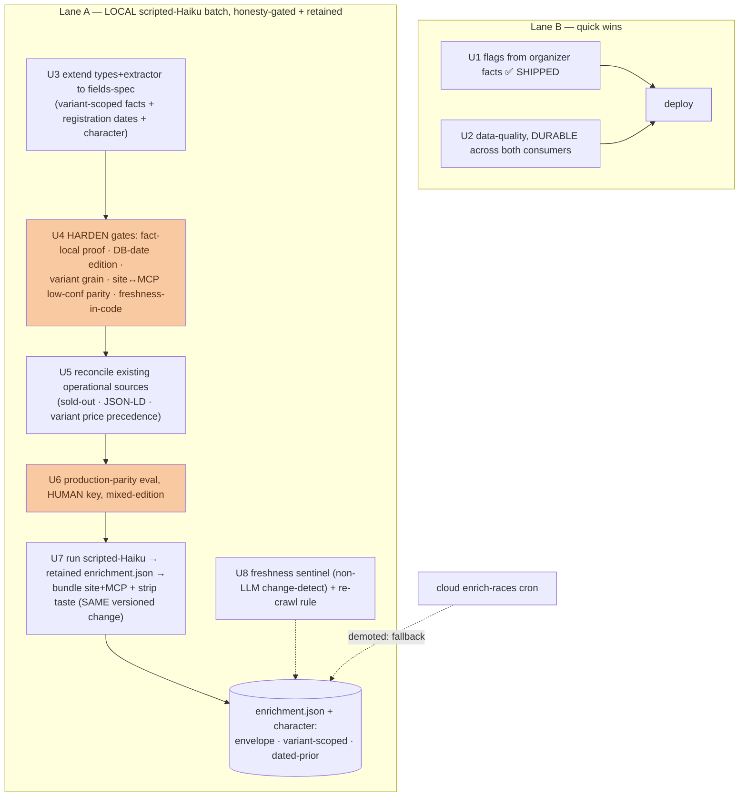

# feat: Enrichment / data-fill phase — trustworthy across all 229 races

Make the agent layer trustworthy across ALL races (229 total, 129 upcoming), not
just the ~84 marquee ones, by collecting the operational facts we lack, generating
character coverage cheaply, fixing derived flags from real organizer data, cleaning
data-quality defects, and closing the operational-facts-in-taste honesty leak —
**without ever publishing a confidently-wrong fact.**

> **Build/review note.** Read `origin/main` (the working tree is often on a feature
> branch — `scripts/deploy-mcp.sh` and `docs/dogfood/2026-08-25-mcp-dogfood-gaps.md`
> both exist on `main`; two internal reviewers false-flagged them as missing).
> **The canonical field schema is `docs/enrichment/fields-spec.md` — this plan builds
> to it; do not re-derive fields here.** Reviewed twice: an internal 3-persona CE pass
> and an external Codex pass (verdict: local direction right, not build-ready for
> publication until the honesty findings below land). U1 is SHIPPED; U2 and the
> crawl can start; U3–U8 (publication) wait on the gates.

## Decisions that shaped this plan (folded from the reviews + Dima)

- **LOCAL, not cloud.** Collect via a local one-off (periodic) batch over the ~200
  mostly-static pages → a committed bundled JSON (the `taste.json` pattern). The
  metered cloud `enrich-races` cron is DEMOTED to a fallback; its non-LLM
  crawl/change-detection is reused as a freshness sentinel (U8).
- **SCRIPTED Haiku, not a free agent swarm (Codex P1-5).** A deterministic scripted
  run — reusing `extract.ts`'s `callAnthropic` with a DEDICATED key + a provider
  spend limit — is a ONE-OFF ~$3–4 for 200 races, and is the only engine that gives
  eval-parity (the code that runs is the code the eval tests). A free in-session
  agent fleet can't be eval-tested; rejected. (This is a one-time cost, not the
  recurring cloud cap.)
- **ONE pass → BOTH facts AND character (Dima).** The same Haiku call per race fills
  the standard operational schema AND generates the character fields — so taste
  expansion (old U8) is largely FREE output of the enrichment pass, not a separate
  manual grind.
- **Retention across editions (Dima).** Data is a retained asset: this year's proven
  facts show as current; last year's as a dated prior ("2025 — likely similar,
  verify"), never as current; `[stable]` facts + character persist. Next year =
  re-confirm + deltas.
- **Publish nothing until the never-run gates are honest.** The reused gates were
  built but never ran on real data and mishandle variant grain, edition proof,
  price staleness, and site↔MCP parity — U4 fixes all before any fact ships.

---

## Problem Frame

The dogfood (mine + Codex) showed the machinery is strong but the DATA is thin
(~37% taste, ~76% difficulty, 0% structured operational facts) and the only
operational data today LEAKS through taste text. The load-bearing risk is NOT
coverage — it is **publishing a confidently-wrong fact**, which for a
honesty-first product is worse than a gap. Codex's cold pass found four code-level
ways this happens in the reused gates (event-level grain for facts that vary by
distance; a circular self-judged edition; price with no staleness ceiling; a
site/MCP gate that disagrees on low-confidence facts) plus a fifth surface we never
reconciled (the scraper already publishes sold-out + prices + JSON-LD availability).
So publication is gated behind U4 (harden), U5 (reconcile sources), and U6 (a
production-parity eval on human-verified real pages).

Governing constraints (AGENTS.md, `docs/rules.md`, `docs/enrichment/fields-spec.md`):
honesty-default-unknown, never fabricate; every fact carries confidence + evidence
(quote must exist on the page) + source_url + edition + last_checked; fail closed;
high-impact facts render with their check-date; site↔MCP parity is real-tested;
deploy is a same-versioned change across two targets, verified by SHA.

---

## Requirements

- **R1.** Derived flags reflect ORGANIZER facts, not the race name. **(U1 SHIPPED —
  kids filter 0→13; Burriac Xtrem lands with U2's override merge.)**
- **R2.** Data-quality defects fixed DURABLY across BOTH consumers (Codex P1-6): the
  Llavaneres duplicate resolved, its province corrected (site JSON + `towns` table +
  a post-scrape override so the weekly scraper can't revert it), ~4 null drive times
  backfilled (both stores), `_overrides/*` merged.
- **R3.** Operational facts are collected to the `fields-spec.md` schema — **variant-
  scoped** where they vary by distance (Codex P0-1: start_time, price, cutoff) — by a
  local scripted-Haiku batch, published from a committed bundled JSON, each with the
  full honesty envelope. Registration is captured as DATES + a DERIVED status, never
  a stale live boolean; sold-out stays scraper-sourced (weekly-fresh).
- **R4.** No fact publishes until the reused gates are HARDENED: fact-local proof +
  fail-closed, a NON-LLM edition cross-check against the DB's known date, variant-
  scoped grain, enforceable freshness IN CODE, and a reconciled site↔MCP
  low-confidence policy — and validated by a production-parity eval on human-verified
  real pages incl. mixed-edition (Codex P0-1/P0-2/P1-4/P1-5).
- **R5.** All existing operational surfaces are reconciled (Codex P0-3): the scraper-
  derived sold-out, race-page variant price, and JSON-LD availability get ONE
  precedence contract; nothing live is published without freshness tracking.
- **R6.** Operational facts are removed from the taste DATA at the source, in the
  SAME versioned change that lights up enrichment, so the public surfaces never show
  two disagreeing sources (Codex "other calls": same versioned change, not atomic
  cross-target deploy — verify both SHAs).
- **R7.** Character coverage grows toward the rest as the SAME pass's output,
  demand-prioritized, holding the honesty bar; retained across editions.

---

## Key Technical Decisions

- **KTD1 — Build to `fields-spec.md`; two tiers.** Standard slots (logistics, route,
  requirements, registration, flags, sources) extracted against the fixed schema;
  the model owns character + outliers. The extractor prompt + output types + gate +
  eval key all reference the spec.
- **KTD2 — Scripted Haiku one-off, variant-scoped output.** Reuse `extract.ts`'s
  `callAnthropic` locally (Deno) with a dedicated spend-limited key; extend its
  prompt + output schema to the full spec, emitting facts **per variant** where the
  spec says `[distance]`. Deterministic → the eval runs the exact production harness
  (Codex P1-5).
- **KTD3 — Harden the never-run gates BEFORE publishing (the honesty core, U4).**
  Four fixes, all code-level:
  - **Fact-local proof + fail-closed** — a fact publishes only if its evidence quote
    is present on the recorded source page and its local context matches the race's
    known date; missing/mixed/unprovable edition → hidden (Codex P0-2).
  - **Non-LLM edition cross-check** — compare the page's extracted year to the DB's
    known date; mismatch forces `edition:previous`→`confidence:low`, independent of
    the model's self-report (fixes the circular self-judge).
  - **Variant grain** — never collapse a per-distance fact to one event scalar unless
    all non-kids variants agree (Codex P0-1).
  - **Reconciled low-confidence policy** — both gates HIDE high-blast facts
    (start_time/confirmed) at low confidence; a real site↔MCP parity test feeds a
    low-confidence prior-edition fact through both and asserts identical (hidden).
- **KTD4 — Freshness is enforced in code, not documented (Codex P1-4).** Missing/
  invalid `last_checked` hides the fact; an event-relative TTL hides overdue facts;
  high-impact facts render "as last checked {date} — confirm at url". A generated
  due-list names required rechecks. The re-crawl N goes into `docs/rules.md`.
- **KTD5 — Retention: current vs dated-prior.** The gate presents a fact proven for
  the current edition as current; a prior-edition fact as an explicit dated prior
  (never in current `enriched_facts` as if live); `[stable]` facts + character persist
  across years. This reconciles Dima's "keep it, it repeats" with Codex's "never
  publish prior-edition as current."
- **KTD6 — Registration as dates + derived status.** Store `registration_opens_on` /
  `_closes_on` (dated facts); DERIVE `registration_status` from them + today; keep
  `sold_out` scraper-sourced (weekly-fresh). No stale live boolean (fields-spec).
- **KTD7 — Reconcile ALL operational sources (Codex P0-3).** Inventory every
  operational read path (RaceCard SOLD OUT, race-page variant price, JSON-LD
  availability, MCP grouped `soldOut`); define ONE precedence (enrichment fact >
  scraper-fresh sold-out > legacy `races.price`); remove any live claim not
  freshness-tracked.
- **KTD8 — Same versioned change, SHA-verified.** Enrichment-bundle + taste-strip
  land in ONE commit; deploy site (Vercel) + MCP (`deploy-mcp.sh`, CLI-from-disk,
  logged-in session) from that SHA and verify both. Not an atomic cross-target
  deploy — the guarantee is one source-of-truth version, both surfaces verified.

---

## High-Level Technical Design

Lane B ships first. Lane A publishes nothing until the gates are hardened (U4),
sources reconciled (U5), and validated on human-verified real pages (U6). U7 runs
the batch + strips taste in one versioned change. Character comes free in the same
pass, so old "taste expansion" is subsumed (R7).

---

## Implementation Units

### U1. Backfill kids/night flags from organizer taste facts — ✅ SHIPPED (2026-08-25)

Live on `main` (`2e542ac`): `kidsFromTaste(profile)` (organizer provenance +
affirmative signal + not-negated), mirrored `app/lib/taste.js` ↔ `taste_view.ts`,
OR'd into the name-derived flag on both surfaces. Kids filter 0→13 races, verified
live. Night already flows via `taste_flags.night`. **Burriac Xtrem lands with U2's
override merge.**

### U2. Data-quality fixes — DURABLE across both consumers

**Goal:** Remove the dogfood/Codex defects so they survive the weekly scrape and both consumers.
**Requirements:** R1 (Burriac Xtrem), R2.
**Dependencies:** none.
**Files:** grouping/merge (`supabase/functions/mcp/grouping.ts` ↔ `app/lib/races.js`), `data/towns-drive-times.json` + `data/towns-geocoded.json` AND the `towns` table (MCP reads the table — Codex P1-6), a post-scrape province/town override mechanism, taste generator + `docs/enrichment/2026-batch/_overrides/`, tests.
**Approach:** (a) dedup Moon/Moontrail Llavaneres by normalized url+date (confirm one event vs a day+night pair from the two source rows first); (b) correct Llavaneres province in BOTH the site JSON and the `towns` table, plus a persistent post-scrape override so the weekly scraper can't revert it (Codex P1-6); (c) backfill the ~4 null drive times in both stores; (d) merge `_overrides/*` (Burriac Atac notes + Burriac Xtrem PDF incl. its kids race → U1 then flags it).
**Test scenarios:** Llavaneres → one id (or two if confirmed distinct), province Barcelona on BOTH site + MCP, and a simulated re-scrape does NOT revert it; null-drive towns resolve on both; Burriac Xtrem override present + `kidsRun:true`; merge key is url+date not name.

### U3. Extend types + extractor to the fields-spec schema

**Goal:** The extractor emits the full spec, variant-scoped.
**Requirements:** R3.
**Dependencies:** none (blocks U6/U7).
**Files:** `supabase/functions/enrich-races/types.ts` (per-variant facts + registration dates + character), `extract.ts` (prompt + output schema to the spec), `classify.ts`, their tests.
**Approach:** extend the fact type to carry a variant key for `[distance]` fields; add registration-date fields + the character block; rewrite the extractor prompt to enumerate the `fields-spec.md` fields + grain rules + "unknown → omit, never guess". Keep `parseFactsResponse`/`coerceFact` as the validation seam.
**Test scenarios:** a staggered-start page → per-variant start_times (not one scalar); a tiered-price page → per-variant prices; a shared value across all variants → an event-level scalar; registration dates parsed as dates; character fields carry claim_strength; an absent field is omitted.

### U4. Harden the never-run gates (the honesty core)

**Goal:** Make the gates honest before any fact is trusted.
**Requirements:** R4.
**Dependencies:** U3 (knows the shapes).
**Files:** `supabase/functions/mcp/enrichment_view.ts` + `app/lib/enrichment.js` (fact-local proof, edition cross-check, variant grain, low-conf policy, freshness-in-code), a NEW site↔MCP enrichment parity test, `classify_test.ts`.
**Approach:** implement KTD3 + KTD4 + KTD5 + KTD6 — fact-local proof/fail-closed; the non-LLM DB-date edition cross-check; variant grain; both-gates-hide low-confidence high-blast + a real parity test; missing/invalid `last_checked` and overdue TTL hide the fact; high-impact facts render with their check-date; prior-edition facts render as dated priors, not current.
**Test scenarios:** a 2025-year page for a 2026 race → `edition:previous`, hidden as current; an evidence quote NOT on the page → fact rejected; a per-variant start_time never collapses to a wrong event scalar; the SAME low-confidence prior-edition fact is hidden by BOTH gates (parity); a fact with no/invalid `last_checked` is hidden; an overdue fact is hidden; a prior-edition fact appears only as a dated prior.

### U5. Reconcile existing operational sources

**Goal:** One precedence contract; no un-fresh live claim.
**Requirements:** R5.
**Dependencies:** U3.
**Files:** `app/components/RaceCard.jsx` (SOLD OUT), `app/race/[slug]/page.js` (variant price + JSON-LD availability), `supabase/functions/mcp/grouping.ts` (grouped `soldOut`), `app/lib/races.js`, tests.
**Approach:** inventory every operational read path; define precedence (enriched fact > weekly-fresh scraper sold-out > legacy `races.price`); remove any live sold-out/availability not backed by a fresh check; make JSON-LD availability reflect only freshness-tracked state.
**Test scenarios:** a race with an enriched price shows it (not the legacy `races.price`); sold-out renders only from the fresh scraper signal with its date; JSON-LD availability is absent when no fresh signal exists; site and MCP agree on sold-out for the same race.

### U6. Production-parity eval — human key, mixed-edition

**Goal:** Trust the exact production harness on real pages before publishing.
**Requirements:** R4.
**Dependencies:** U3, U4.
**Files:** `supabase/functions/enrich-races/fixtures/` (real pages + a HUMAN-verified expected-output key), the extractor/gate tests running the EXACT scripted harness.
**Approach:** capture rich / partial / sparse / prior-edition-only / **mixed-edition** / JS-heavy real pages; Dima hand-verifies the expected values against the live page (not the extracting agent — self-grading copies a misread into the key); run the production scripted-Haiku harness against them; assert the U4 behaviors incl. the DB-date cross-check firing on the mixed-edition page. Produce a candidate artifact first; promote only proven facts.
**Test scenarios:** each fixture's extracted output matches the human key through the real harness; the mixed-edition page's prior-year time is caught + downgraded; a fabricated fact fails; the answer-key provenance is recorded.

### U7. Run the batch → retained enrichment.json → bundle + strip taste (same versioned change)

**Goal:** Publish operational facts + character, and remove the taste leak, in one version.
**Requirements:** R3, R6, R7.
**Dependencies:** U3, U4, U5, U6.
**Files:** the scripted batch runner (Deno, reusing `extract.ts` + the gate), `docs/enrichment/2026-batch/parsed/enrichment.json`, `supabase/functions/mcp/enrichment.json` (Codex path fix — under `supabase/functions/mcp/`, not `mcp/`), wiring in `app/lib/races.js` + `supabase/functions/mcp/tools.ts` to read the bundled JSON via `enrichment_view` (add `source_url` to `McpFact`), `scripts/build-taste.mjs` + regenerated `taste.json`/`mcp/taste.json` with operational content excluded at the source chunks (not regex-over-prose), tests.
**Approach:** run the batch over the U3 corpus through the hardened gate; write `enrichment.json` (variant-scoped, envelope, dated-prior retention, no un-fresh live). In the SAME commit, regenerate taste with operational content removed at the source. Deploy both from one SHA and verify (KTD8). Character generated in the pass IS the taste expansion (R7).
**Test scenarios:** a race shows enriched facts on BOTH surfaces identically (was null); its taste no longer carries a start time/price/sold-out; a structured-key scan (independent patterns) finds no operational leak; MCP facts carry source_url; a race absent from the JSON still renders; both deploy SHAs match the source commit.

### U8. Freshness sentinel + re-crawl rule

**Goal:** Facts don't silently rot; changed sources are caught cheaply.
**Requirements:** R4, R7.
**Dependencies:** U7.
**Files:** a non-LLM change monitor reusing `enrich-races/changes.ts` (fetch + hash the source; on change, mark facts for re-extraction), the re-crawl N written into `docs/rules.md`, tests.
**Approach:** cheap periodic fetch+hash of each source; when a page changes, suppress its facts until locally re-extracted; write the `[edition]` re-crawl-within-N-days rule + `[stable]` re-confirm cadence into `docs/rules.md`. This is where the demoted cloud pipeline's non-LLM pieces earn their keep.
**Test scenarios:** a changed source hash suppresses its facts until re-run; an unchanged source keeps its facts; the due-list surfaces upcoming races needing a recheck.

---

## Scope Boundaries

**In scope:** durable flag/data-quality fixes; the fields-spec schema; a local
scripted-Haiku batch → retained bundled `enrichment.json` (facts + character);
gate hardening + source reconciliation; the taste operational-strip; a freshness
sentinel.

**Deferred to Follow-Up Work:**
- The cloud `enrich-races` cron + `race_enrichment` table — fallback for automated
  weekly freshness (its non-LLM crawl/change-detection is reused in U8).
- Variant-scoped difficulty filter; ordering/pagination beyond the 50-cap;
  community moderation; localization (gated on this phase + a search signal).

**Outside this product's identity:** fabricating any field; publishing without the
envelope; a stale live sold-out/registration; a prior-edition fact shown as current.

---

## Risks & Dependencies

- **Publishing a confidently-wrong fact (core risk).** Fixed in U4 (fact-local proof,
  non-LLM edition, variant grain, parity) + U5 (source reconciliation) + U6 (human
  key) BEFORE publication.
- **Eval that doesn't test production (Codex P1-5).** The scripted Haiku harness is
  the exact code the eval runs; the key is human-verified.
- **Staleness (Codex P1-4).** Enforced in code (TTL, missing-date hides) + a change
  sentinel (U8) + dated-prior render — not a doc rule.
- **Two-consumer/scraper durability (Codex P1-6).** U2 corrects both stores + a
  post-scrape override.
- **Double-source window (Codex).** U7 lands enrichment + strip in one versioned
  change, SHA-verified across both deploy targets.
- **Cost.** Local scripted one-off ~$3–4 (dedicated key + provider spend limit); not
  the recurring cloud cap. Deploy is attended (logged-in Supabase session).

---

## Open Questions

- **Taste-expansion coverage order (R7/U7):** which races to run first — upcoming,
  then `mcp_query_log`/intent-log demand. Default: upcoming-first, incremental.
- **Re-crawl N + `[stable]` re-confirm cadence (U8/KTD4):** the exact days-before-race
  — settle from first-batch drift; write into `docs/rules.md`.
- **Moontrail Llavaneres:** one event or a day+night pair? Resolve from the two rows.
- **Fields-spec additions:** any runner-critical field still missing (parking/access?
  previous winners' times? weather exposure?) — add to `fields-spec.md` before U3.
