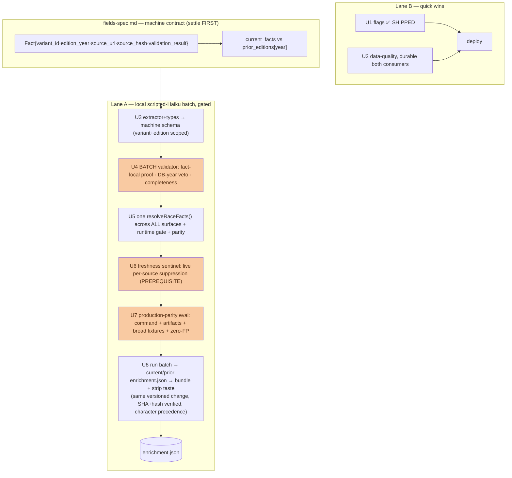

# feat: Enrichment / data-fill phase — trustworthy across all 229 races

Make the agent layer trustworthy across ALL races (229 total, 129 upcoming) by
collecting operational facts, generating character coverage cheaply, fixing derived
flags from real organizer data, cleaning data-quality defects, and closing the
operational-facts-in-taste honesty leak — **without ever publishing a confidently-wrong
fact.** The honesty design is the hard part and is where two Codex rounds concentrated.

> **Build/review note.** Read `origin/main` (working tree is often on a feature branch).
> **The machine data-contract is `docs/enrichment/fields-spec.md` — this plan builds to
> it; the contract (record shape, per-field grain, validation timing, freshness state,
> resolver) is settled there, not re-derived here.** Reviewed: internal 3-persona CE +
> two Codex rounds. **U1 SHIPPED; U2 + U3-crawl buildable now; publication (U4–U8) waits
> on the contract + the four honesty mechanisms below.**

## Decisions folded from the reviews + Dima

- **Local scripted-Haiku one-off** (~$3–4, dedicated spend-limited key) — the only
  engine with eval-parity (Codex r1-P1-5). Cloud cron demoted; its non-LLM
  crawl/change-detection is REUSED as the freshness monitor (not demoted — Codex r2).
- **One pass → facts AND character.** Taste expansion is free output of the same call.
- **Validation at BATCH-PROMOTION, not the runtime gate** (Codex r2-P0-1): the gate has
  no page content. The batch proves each quote against exactly one captured page and
  records `validation_result`; the runtime gate trusts it.
- **Retention keyed by exact `edition_year`** with isolated `current_facts` vs
  `prior_editions[year]`; history renders neutrally ("2025 edition: … — 2026
  unverified"), never "likely similar", never as current.
- **Freshness is a LIVE state that SUPPRESSES** (Codex r2-P0-3): a bundled JSON can't
  invalidate itself, so a cheap non-LLM monitor persists per-source state the site/MCP
  check per request/ISR; not-`fresh` hides the fact. This is a publication PREREQUISITE.
- **One shared resolver across every surface** (Codex r2-P0-4): race page, card,
  homepage JSON-LD, AI prompts, MCP all read one `resolveRaceFacts()`; resolution is
  per-field, never cross-field.
- **Full variant + edition grain** for every actionable field (Codex r2-P0-2), with an
  event-scalar completeness rule (all DB variants agree, none missing).

---

## Problem Frame

The dogfood + two Codex passes agree: the machinery is strong, the data is thin, and
the load-bearing risk is **publishing a confidently-wrong fact** (a stale start time, a
prior-edition price, a false "in stock", a variant-wrong cutoff), which for an
honesty-first product is worse than a gap. The reused gates were built but never ran on
real data and can't, as written, guarantee that bar — the fixes are a precise machine
contract (`fields-spec.md`) plus four mechanisms: batch-time proof, live freshness
suppression, one per-field resolver, and a production-parity eval. Publication is gated
behind all four.

Governing constraints (AGENTS.md, `docs/rules.md`, `fields-spec.md`): honesty-default-
unknown, never fabricate; the full machine envelope on every fact; fail closed on
no/mixed-year or ambiguous page/variant; site↔MCP parity real-tested; deploy is a
same-versioned change across two targets, SHA+payload-hash verified.

---

## Requirements

- **R1.** Derived flags reflect ORGANIZER facts. **(U1 SHIPPED — kids 0→13; Burriac Xtrem
  lands with U2.)**
- **R2.** Data-quality defects fixed DURABLY across BOTH consumers (Codex r1-P1-6):
  Llavaneres duplicate resolved, province corrected in site JSON + `towns` table + a
  post-scrape override, null drive times backfilled both stores, `_overrides/*` merged.
- **R3.** Operational facts are collected to the `fields-spec.md` MACHINE SCHEMA —
  variant-scoped + edition-year keyed, each with the full envelope + a batch
  `validation_result` — by a local scripted-Haiku batch, published from a committed
  bundle. Registration is dates + a derived status; sold-out stays scraper-fresh.
- **R4.** No fact publishes until: (a) each quote is proven against one captured page at
  batch time and fails closed on no/mixed-year/ambiguous (Codex r2-P0-1); (b) grain is
  full per-field with the completeness rule (r2-P0-2); (c) a live freshness monitor can
  suppress a bundled fact (r2-P0-3); (d) one per-field resolver feeds every surface
  (r2-P0-4); validated by a production-parity eval on a human key (r1-P1-5/r2-P1-5).
- **R5.** Retention: `current_facts` render current; `prior_editions[year]` render as
  neutral dated history, never current.
- **R6.** Operational content removed from taste at the source, in the SAME versioned
  change that lights up enrichment; deploy both targets from an explicit SHA, expose +
  match a payload hash from each, and keep both mixed-version transient states
  honesty-safe (Codex r2-P1-6).
- **R7.** Character coverage grows as the same pass's output; new validated character
  overrides legacy taste for processed races, legacy remains only for unprocessed ones
  (Codex r2-P1-7); demand-prioritized; retained.

---

## Key Technical Decisions

- **KTD1 — Build to the `fields-spec.md` machine contract.** Record shape, per-field
  grain matrix, validation timing, freshness state, and the resolver are defined there;
  U3–U8 implement it. The contract must be settled before U3 (Codex: U3 waits on it).
- **KTD2 — Scripted Haiku, machine-shaped, variant + edition scoped.** Reuse
  `extract.ts` locally (Deno, dedicated spend-limited key); extend prompt + output to
  the machine schema, emitting per-variant + `edition_year` + the specific `source_url`
  (which captured page) + `source_hash`.
- **KTD3 — Proof at batch promotion; the runtime gate trusts the result.** The batch
  validator checks each `evidence_quote` occurs on its `source_url` page and its local
  context matches the DB date; sets `validation_result`. Fail closed on no-year,
  mixed-year, ambiguous page/variant. The DB-year comparison is a NEGATIVE veto (forces
  fail), not positive proof — cross-year events may false-negative and no-year pages
  lose coverage; both are honesty-safe.
- **KTD4 — Event scalar only on completeness.** Publish variant_id=null only when every
  eligible non-kids DB variant has a grounded, identical, validated value; a missing
  variant blocks the scalar (per-variant or nothing).
- **KTD5 — Freshness is a live, suppressing state (prerequisite).** A cheap non-LLM
  monitor fetch+hashes each source and persists `fresh|changed|overdue|error`; MCP
  checks per request, site during ISR; not-`fresh` hides the current fact until local
  re-extraction clears it. An event-relative TTL and missing/invalid `last_checked`
  also hide. This exists BEFORE any publication.
- **KTD6 — One shared `resolveRaceFacts()` for every surface.** Per-field resolution
  (enriched current price > fresh-scraper price > hide stale legacy; fresh sold-out
  overrides date-derived registration; JSON-LD availability only from a fresh signal;
  registration derived+labelled). Consumed identically by race page, card, homepage
  JSON-LD, AI prompts, and MCP — one projection, parity-tested.
- **KTD7 — Retention render.** `current_facts` current; `prior_editions[year]` neutral
  ("2025 edition: 08:00 — 2026 unverified"); never "likely similar"; never mixed.
- **KTD8 — Character precedence.** New validated character overrides legacy `taste.json`
  character for processed races; legacy remains only for unprocessed races; one shared
  character projection, mirror-tested.
- **KTD9 — Same versioned change, SHA + payload-hash verified.** Deploy both targets
  from an explicit full SHA (extend `deploy-mcp.sh` to accept a pinned SHA, not just
  latest `origin/main`); expose the commit SHA + enrichment payload hash from the SITE
  (it exposes none today) and the same hash from the MCP; require a match; both
  old-site/new-MCP and new-site/old-MCP transient states must be independently
  honesty-safe.

---

## High-Level Technical Design

Nothing publishes until the contract is settled and U4 (proof) + U5 (resolver) + U6
(live suppression) + U7 (eval) all exist. U8 is the only publishing unit.

---

## Implementation Units

### U1. Flags from organizer taste facts — ✅ SHIPPED (2026-08-25, `2e542ac`)
`kidsFromTaste` mirrored site↔MCP; kids filter 0→13 verified live. Night via
`taste_flags.night`. Burriac Xtrem lands with U2.

### U2. Data-quality fixes — durable across both consumers
**Goal/Requirements:** R1 (Burriac Xtrem), R2. **Dependencies:** none.
**Files:** grouping/merge (`grouping.ts` ↔ `app/lib/races.js`), `data/towns-*.json` AND the `towns` table, a post-scrape override, taste generator + `_overrides/`, tests.
**Approach:** dedup Moon/Moontrail by url+date (confirm one vs day+night first); correct Llavaneres province in site JSON + `towns` table + a persistent post-scrape override (Codex r1-P1-6); backfill null drives both stores; merge `_overrides/*`.
**Test scenarios:** province correct on both surfaces AND survives a simulated re-scrape; null drives resolve both; Burriac Xtrem override present + `kidsRun:true`; merge key url+date.

### U3. Extractor + types → the machine schema
**Goal/Requirements:** R3. **Dependencies:** the settled `fields-spec.md` contract.
**Files:** `enrich-races/types.ts`, `extract.ts` (prompt+output), `classify.ts`, tests.
**Approach:** emit `Fact` per the contract — `variant_id`, `edition_year`, the specific `source_url` + `source_hash`, evidence quote — per-variant where the grain matrix says V, plus character. Unknown → omit.
**Test scenarios:** staggered page → per-variant start_times; tiered page → per-variant prices with category; a fact carries the page it's on (not the seed url); character carries claim_strength; absent field omitted; `edition_year` populated.

### U4. Batch-promotion validator (fact-local proof + veto + completeness)
**Goal/Requirements:** R4(a,b). **Dependencies:** U3.
**Files:** a batch validator reusing `parseFactsResponse`/`coerceFact` + the captured pages, `classify.ts` edition veto, tests.
**Approach:** for each fact, confirm `evidence_quote` occurs on its `source_url` captured page and context matches the DB date → `validation_result`; DB-year mismatch vetoes to fail; no-year/mixed/ambiguous fail closed; event-scalar only on the completeness rule (KTD4).
**Test scenarios:** quote absent from the page → failed; DB-year mismatch → failed (veto); no parseable year → failed (safe); 3 DB variants with one missing → no event scalar; two agreeing variants + one differing → per-variant, not scalar.

### U5. One `resolveRaceFacts()` + runtime gate + parity
**Goal/Requirements:** R4(d), R5. **Dependencies:** U4.
**Files:** a shared `resolveRaceFacts` (site + MCP), `enrichment_view.ts` + `app/lib/enrichment.js`, `app/components/RaceCard.jsx`, `app/race/[slug]/page.js`, `app/page.js` (homepage JSON-LD), `app/components/askPrompt.js` (prompt soldOut), `supabase/functions/mcp/tools.ts` + protocol, a NEW site↔MCP parity test.
**Approach:** per-field resolution (KTD6); retention render (KTD7); both gates hide low-confidence high-blast; EVERY surface (incl. homepage JSON-LD + prompts + MCP) reads the one projection. Parity-test a low-confidence prior-edition fact through both.
**Test scenarios:** fresh sold-out overrides date-derived open; JSON-LD never InStock from mere sold-out absence; prior-edition fact renders as neutral history not current; site==MCP for the same fact; the homepage/prompt/card all reflect the resolver, not raw scraper state.

### U6. Freshness sentinel — live per-source suppression (PREREQUISITE)
**Goal/Requirements:** R4(c). **Dependencies:** U5 (the gate reads its state). *Precedes publication.*
**Files:** a non-LLM monitor reusing `enrich-races/changes.ts`, a persistent per-source state store, the gate's state check, `docs/rules.md` (TTL + cadence), tests.
**Approach:** fetch+hash each source; persist `fresh|changed|overdue|error`; MCP checks per request, site during ISR; `source_hash` mismatch / overdue TTL / monitor error → suppress the current fact until re-extraction clears it. Automate the monitor (Codex: keep this cloud piece).
**Test scenarios:** changed source hash suppresses its facts; unchanged keeps them; overdue TTL suppresses; monitor error fails closed; re-extraction clears state.

### U7. Production-parity eval — executable command + artifacts + broad fixtures
**Goal/Requirements:** R4 (validation). **Dependencies:** U3, U4, U5, U6.
**Files:** an attended eval command + recorded run artifacts, `enrich-races/fixtures/` (real pages + HUMAN key), tests.
**Approach:** run the EXACT scripted harness; record model id, prompt hash, fixture hashes, raw output, post-gate results; require ZERO false-positive actionable facts (not exact character prose). Fixtures: no-provable-year; 3 DB variants one absent; variant-specific sold-out/cancel; price tiers; a real quote on the WRONG subpage / wrong edition heading; fresh sold-out vs date-derived open; repeated runs of the highest-risk fixtures (model variance). The command emits the crawl/failure manifest the batch consumes.
**Test scenarios:** each fixture matches the human key through the harness; zero false-positive actionable facts across repeats; the wrong-subpage quote fails; the variant-absent case blocks the scalar.

### U8. Run batch → current/prior enrichment.json → bundle + strip taste (same versioned change)
**Goal/Requirements:** R3, R6, R7. **Dependencies:** U3–U7.
**Files:** the Deno batch runner, `docs/enrichment/2026-batch/parsed/enrichment.json` (current_facts + prior_editions), `supabase/functions/mcp/enrichment.json`, wiring in `app/lib/races.js` + `tools.ts` (+ `source_url` on `McpFact`, + payload-hash exposure), site SHA/hash exposure (`app/page.js` or a build-info surface), `scripts/build-taste.mjs` (operational content excluded at source chunks) + regenerated taste, `scripts/deploy-mcp.sh` (accept a pinned SHA), tests.
**Approach:** run through the U4 validator + U5 resolver + U6 state; write current/prior JSON; regenerate taste stripped at source in the SAME commit; character precedence (KTD8); deploy both from the pinned SHA and match the payload hash (KTD9).
**Test scenarios:** a race shows resolved facts identically on both surfaces (was null); its taste carries no operational string (source-scan, independent patterns); new character overrides legacy for that race; both deploy SHAs + payload hashes match; a suppressed (not-fresh) fact is hidden on both; a race absent from the bundle still renders.

---

## Scope Boundaries
**In scope:** durable flag/data-quality; the machine contract; a local scripted-Haiku
batch → validated, retained bundle (facts + character); the four honesty mechanisms;
taste strip; the freshness monitor.
**Deferred:** the cloud `enrich-races` cron + `race_enrichment` table (its non-LLM
crawl/change-detection is reused in U6); variant-scoped difficulty filter; pagination;
community moderation; localization.
**Outside identity:** fabricating any field; publishing without the machine envelope +
`validation_result`; a stale live sold-out/registration; a prior-edition fact as current.

---

## Risks & Dependencies
- **Confidently-wrong fact (core).** Closed by U4 (batch proof + veto + completeness) +
  U5 (per-field resolver, all surfaces) + U6 (live suppression) + U7 (human-key eval).
- **Contract precision.** U3+ blocked until `fields-spec.md`'s record/grain/validation
  are settled (Codex r2).
- **Freshness/suppression.** A prerequisite live state (U6), not a doc rule.
- **Deploy provability.** Pinned SHA + payload-hash from both surfaces (KTD9); the site
  exposes none today and `deploy-mcp.sh` fetches latest — both fixed in U8.
- **Cost.** Local scripted one-off ~$3–4 (dedicated spend-limited key). Deploy attended.
- **Coverage loss is honesty-safe.** No-year/cross-year pages lose facts rather than
  publish unproven ones.

---

## Open Questions
- **Coverage order (U8):** upcoming-first then demand (`mcp_query_log`/intent-log).
- **Event-relative TTL + `[stable]` cadence (U6/KTD5):** exact values → `docs/rules.md`.
- **Moontrail Llavaneres:** one event or day+night pair? Resolve from the two rows.
- **Fields-spec additions:** any runner-critical field still missing → add before U3.
