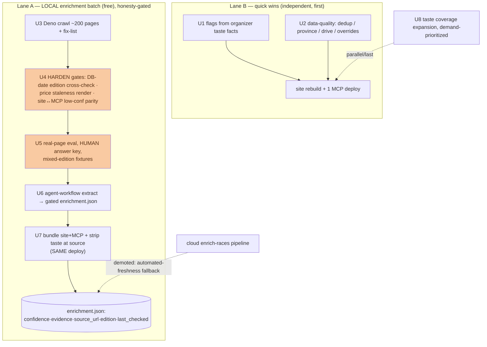

# feat: Enrichment / data-fill phase — trustworthy across all 229 races

Make the agent layer trustworthy across ALL races (229 total, 129 upcoming), not
just the ~84 marquee ones, by collecting the operational facts we lack (locally,
free), expanding taste coverage, fixing derived flags from real organizer data,
cleaning data-quality defects, and closing the operational-facts-in-taste honesty
leak at the data level — **without ever publishing a confidently-wrong fact.**

> **Build/review note.** Read `origin/main` (the working tree is often on a feature
> branch — `scripts/deploy-mcp.sh` and `docs/dogfood/2026-08-25-mcp-dogfood-gaps.md`
> both exist on `main`). **Key decision (Dima, 2026-08-25): collect operational facts
> as a LOCAL, agent-driven batch over the ~200 mostly-static race pages, committed as
> a bundled JSON (the `taste.json` pattern) — NOT the metered cloud `enrich-races`
> pipeline.** The cloud pipeline (`supabase/functions/enrich-races/`, origin plan
> `2026-06-23-001`) is DEMOTED to a documented fallback for automated weekly
> freshness. **This plan was internally reviewed (coherence/feasibility/adversarial)
> and the reviews surfaced that the reused enrich-races gates were BUILT BUT NEVER RUN
> ON REAL DATA and carry honesty holes — hardening those gates (U4) is a prerequisite
> to publishing any fact.** Dogfood backlog closed: `docs/dogfood/2026-08-25-mcp-dogfood-gaps.md`.

---

## Problem Frame

The dogfood (mine + an independent Codex pass) showed the machinery is strong but the
DATA is thin: ~37% of races have taste, ~76% have difficulty, and operational facts
(start time, price, confirmed status) are **0% structured** — existing today only as
unreliable mentions leaking through taste editorial text, which we patched agents to
distrust. The scale (~200 mostly-static pages) makes a LOCAL agent batch the right
tool: crawl once, extract with an agent, commit a gated JSON, bundle it.

The load-bearing risk is NOT coverage — it is **publishing a confidently-wrong fact**,
which is worse than a gap for a product whose value is honesty. The reused extractor
and gates were never run on real data and, on inspection, mishandle three honesty
cases (prior-edition self-judgement, price with no staleness ceiling, a site/MCP gate
disagreement on low-confidence facts). So this phase publishes NOTHING until those
gates are hardened and validated on real, human-verified pages.

Governing constraints (AGENTS.md + `docs/rules.md`): honesty-default-unknown, never
fabricate; every published fact carries confidence + evidence + source url + edition +
last_checked; high-impact facts are rendered with their check date, not as bare
certainty; site↔MCP parity is real-tested; deploy discipline (site via Vercel push;
MCP via `scripts/deploy-mcp.sh` — which uses the Supabase CLI-from-disk and needs a
logged-in session, so re-runs are attended). Lag-tolerance is proven: facts light up
incrementally with no broken mid-phase state.

---

## Requirements

- **R1.** Kids/night flags reflect ORGANIZER-confirmed facts, not just the race name —
  a sub-event kids race (Burriac Xtrem's, Llavaneres Ironkids, Cabrianes Mini CabróRun)
  sets the flag. No false zero.
- **R2.** The dogfood/Codex data-quality defects are fixed: "Moon Trail / Moontrail
  Llavaneres" resolved, Llavaneres province corrected, ~4 null drive times backfilled,
  `_overrides/*` (Burriac Atac + Burriac Xtrem) merged into published taste.
- **R3.** Operational facts — **start_time, price, confirmed_status** (2026 edition
  confirmed/cancelled) — are collected by a local batch and published from a committed
  bundled JSON, each with confidence + evidence + source url + edition + last_checked.
  Genuinely volatile facts (live registration-open / sold-out) are NOT snapshotted;
  they keep "verify at url". (Distances are NOT operational facts — already in the DB.)
- **R4.** No fact is published until the reused gates are HARDENED (edition cross-check,
  price staleness, site↔MCP low-confidence parity) and validated on real, HUMAN-verified
  pages including mixed-edition ones. A wrong published fact is a phase failure.
- **R5.** Once operational facts live in the freshness-tracked JSON, they are removed
  from the taste DATA at the source (not regex-over-prose), in the SAME deploy that
  lights up enrichment — so the site never shows two disagreeing sources at once.
- **R6.** Taste/character coverage expands beyond 84 toward the rest, demand-prioritized,
  holding the Slice-1 honesty bar — never fabricating to fill.

---

## Key Technical Decisions

- **KTD1 — LOCAL agent batch → committed bundled JSON, mirroring `taste.json`.** A
  Deno script crawls the ~200 pages; an AGENT (in-session, Dima's "you or Codex")
  extracts facts per race — this is the genuinely free path. Reuse from `enrich-races/`
  is the VALIDATION + GATE + TYPES only (`parseFactsResponse`/`coerceFact`,
  `enrichment_view`, `types.ts`) — NOT `extractFacts`/`callAnthropic`, which is a
  metered Anthropic call (using it would reintroduce the API key + spend limit KTD1
  avoids). ~200 races × up to 4 pages × 12 KB won't fit one context, so extraction is a
  batched sub-agent fan-out (a compound-engineering Workflow, one agent per race/small
  batch). Output: a git-versioned `enrichment.json` gated by `enrichment_view`, bundled
  into site + MCP as `taste.json` is. Table→JSON swap is a localized change in
  `tools.ts` + `races.js` (both already take the same `{race_url,town,fact...}` shape —
  the strongest, lowest-risk part of this plan). *(Alternative: a scripted one-off
  `extract.ts` call — ~$3–4 total for 200 races at Haiku rates, keyed but cheap; noted
  in Open Questions, not the default.)*
- **KTD2 — Flags derive from organizer_fact taste attributes, not the race name.**
  Add `flagsFromTaste(profile)` returning `{kids?,night?}` when the profile has an
  ORGANIZER-affirmed `kids_race`/`night_race`, reusing the organizer-provenance +
  affirmative/negation gate already in `tasteFlags`; OR it into the name-derived flag;
  mirror site↔MCP; parity-test. (18 races already have an organizer `kids_race`.)
- **KTD3 — Harden the never-run gates BEFORE trusting them (the honesty core).** The
  reused gates were built but never ran on real data and mishandle three cases:
  - **Edition is self-judged and circular** — `extract.ts` asks the model to tag
    `edition`, and the only correction (`coerceFact`: `previous→low`) fires only when
    the model already admitted "previous". A 2025-banner page with 2026 registration
    can be tagged `edition:2026,high` with nothing to catch it. **Fix: a NON-LLM
    cross-check — compare the page's extracted year against the DB's known 2026 date;
    on mismatch force `edition:previous`→`confidence:low`, regardless of the model.**
  - **Price has no staleness ceiling** — both gates show price "regardless of age".
    **Fix: render price as "≈35€ (as last checked {date}) — verify at url", never a
    bare confident value; or give it a ceiling.**
  - **Site and MCP disagree on low-confidence** — the site hides a low-confidence
    high-blast start_time (`return null`); the MCP publishes it (drops only `unknown`).
    So a prior-edition start time is hidden on the site but surfaced to agents.
    **Fix: reconcile to ONE policy — both HIDE high-blast facts at low confidence — and
    add a real parity test feeding a low-confidence prior-edition fact through both.**
- **KTD4 — Freshness is honest, not implied.** `last_checked` communicates recency of
  OUR check, not truth — it can't catch a mid-window correction. So high-impact facts
  (start_time, confirmed_status) render "as last checked {date} — confirm at url", and
  a HARD re-crawl rule goes into `docs/rules.md`: re-crawl each upcoming race within N
  days of its date. Live sold-out/registration is never snapshotted.
- **KTD5 — Extraction honesty is validated by a HUMAN answer key on real pages,
  including mixed-edition.** U5's eval expected-values are hand-verified by Dima (not the
  extracting agent — self-grading would copy a systematic misread into the key). The
  fixture spread MUST include the mixed-edition page (last year's time in prose above
  this year's table — the 13 events `rules.md` T2 documents), the case where the edition
  bug bites, and assert the DB-date cross-check catches it.
- **KTD6 — Strip taste at the SOURCE, in the SAME deploy as enrichment.** Removing
  operational content by regex over free-text editorial prose clobbers legit character
  ("the 5am headlamp start ritual" is character) and misses Catalan/digit-free leaks
  ("surt de matinada"). Instead, regenerate the editorial fields excluding operational
  specifics (human spot-check), and scope any regression scan to STRUCTURED keys +
  independent patterns. Land the strip in the SAME deploy that lights up
  `enrichment.json` (KTD/U ordering), so the public site never renders two disagreeing
  start times during a deploy gap.

---

## High-Level Technical Design

Lane B ships first, standalone. Lane A publishes nothing until the gates are hardened
(U4) and validated on human-verified real pages (U5). U6 extraction + U7 bundling and
the taste-strip land together. U8 is the long tail.

---

## Implementation Units

### U1. Backfill kids/night flags from organizer taste facts

**Goal:** Flags reflect organizer-confirmed sub-event facts, not just the race name.
**Requirements:** R1.
**Dependencies:** none.
**Files:** `app/lib/races.js`, `supabase/functions/mcp/grouping.ts` + `tools.ts`, shared derivation in `app/lib/taste.js` ↔ `supabase/functions/mcp/taste_view.ts`, tests (`app/lib/taste.test.mjs`, `taste_view_test.ts`).
**Approach:** `flagsFromTaste(profile)` → `{kids?,night?}` from an ORGANIZER-affirmed `kids_race`/`night_race`, reusing the `tasteFlags` organizer/affirmation gate; OR into the name-derived flag; mirror + parity-test.
**Test scenarios:** name lacks keyword but organizer `kids_race:"Mini CabróRun"` → true; organizer "No"/negation → not set; our_read/inference → not set; site==MCP (parity); existing name-derived still flags.

### U2. Data-quality fixes (dedup · province · drive · overrides)

**Goal:** Remove the concrete dogfood/Codex defects.
**Requirements:** R2.
**Dependencies:** none.
**Files:** grouping/merge path (`grouping.ts` ↔ `races.js`), `data/towns-drive-times.json` + `data/towns-geocoded.json`, taste generator + `docs/enrichment/2026-batch/_overrides/`, tests.
**Approach:** dedup Moon/Moontrail Llavaneres by normalized url+date (confirm one event vs a day+night pair first); correct Llavaneres province (Barcelona/Maresme); backfill null drive times via the "New town" runbook; merge `_overrides/*` (incl. Burriac Xtrem's kids race) so U1 picks it up.
**Test scenarios:** Llavaneres → one id (or two if confirmed distinct), province Barcelona; null-drive towns resolve; Burriac Xtrem override present + flags kids; merge key is url+date not name.

### U3. Deno crawl of the race pages (+ fix-list the unreachable)

**Goal:** A local corpus of full page text to extract from.
**Requirements:** R3.
**Dependencies:** none.
**Files:** a Deno crawl script (new, run via `deno run --allow-net --allow-env --allow-read` — NOT a Node `.mjs`, because it reuses Deno-TS `enrich-races/fetch.ts`), a git-ignored raw-HTML cache, a committed fetched/failed manifest extending `docs/enrichment/2026-batch/_fix-list.md`.
**Approach:** read each race url, download full static HTML, reuse `fetch.ts`'s `htmlToText`/`discoverPageLinks`/limits (`MAX_PAGES_PER_RACE`, `MAX_PAGE_CHARS`); rate-limit; triage JS-only/403/dead into the fix-list.
**Test scenarios:** a static page fetched full; a 403/JS-only page recorded in the fix-list (not dropped); manifest reconciles (every race fetched or fix-listed).

### U4. Harden the never-run gates (edition cross-check · price · parity)

**Goal:** Make the reused gates honest before any fact is trusted.
**Requirements:** R4.
**Dependencies:** none (blocks U5).
**Files:** `supabase/functions/enrich-races/classify.ts` (or a new edition cross-check), `supabase/functions/mcp/enrichment_view.ts` + `app/lib/enrichment.js` (reconcile low-confidence policy + price render), their tests + a NEW site↔MCP enrichment parity test.
**Approach:** (a) **DB-date edition cross-check** — compare the extracted page year vs the race's known 2026 date; mismatch → force `edition:previous`→`confidence:low`, deterministically, independent of the model's self-report. (b) **Price** — render "≈{price} (as last checked {date}) — verify at url", never bare. (c) **Parity** — reconcile both gates to HIDE high-blast facts (start_time/confirmed_status) at low confidence, matching the site; add a parity test feeding a low-confidence prior-edition fact through both and asserting identical (hidden) output.
**Test scenarios:** a 2025-year page for a race whose DB date is 2026 → `edition:previous`, hidden as high-blast; price always carries its check-date qualifier; the same low-confidence fact is hidden by BOTH gates (parity); a high-confidence current fact passes both identically.

### U5. Real-page eval — human answer key, mixed-edition fixtures

**Goal:** Trust the hardened gate on real pages before publishing.
**Requirements:** R4.
**Dependencies:** U3, U4.
**Files:** `supabase/functions/enrich-races/fixtures/` (real pages + a HUMAN-verified expected-output key), `extract_test.ts`/`classify_test.ts`/the gate test.
**Approach:** capture rich / partial / sparse / prior-edition-only / **mixed-edition** / JS-heavy real pages; Dima (not the extracting agent) hand-verifies the expected values against the live page, recorded with its address. Assert honest output incl. the U4 DB-date cross-check firing on the mixed-edition page.
**Test scenarios:** rich → high-confidence facts + evidence + source_url; sparse → absent, not fabricated; prior-edition + mixed-edition → flagged previous / cross-check fires; JS-heavy unreadable → no facts; every published fact carries the full envelope; the answer key is human-verified (documented).

### U6. Agent-workflow extraction → gated `enrichment.json`

**Goal:** Extract facts locally (free) into the gated JSON.
**Requirements:** R3, R4, R6.
**Dependencies:** U3, U4, U5.
**Files:** an extraction orchestrator (a compound-engineering Workflow or batched agent runner) reusing `parseFactsResponse`/`coerceFact` (`extract.ts`) + `enrichment_view` gate + `types.ts`, output `docs/enrichment/2026-batch/parsed/enrichment.json`, tests over the parse/gate.
**Approach:** fan out over races (one agent per race/small batch — 200 pages don't fit one context); each returns structured facts validated by `coerceFact` + the hardened gate (drop low-confidence high-blast, force previous on the DB-date mismatch); write `enrichment.json` with the full envelope + `last_checked`. No live sold-out/registration.
**Test scenarios:** the JSON validates against `types.ts`/`FactSet`; every fact carries the envelope; a mismatched-edition fact is downgraded; no live sold-out present; a race with no confident fact simply has none (not fabricated).

### U7. Bundle site+MCP + strip taste at source (SAME deploy)

**Goal:** Publish enrichment AND remove taste's operational leak together — no double-source window.
**Requirements:** R3, R5.
**Dependencies:** U6.
**Files:** `app/lib/races.js` + `supabase/functions/mcp/tools.ts` (read the bundled `enrichment.json` via `enrichment_view` instead of the `race_enrichment` table; add `source_url` to the MCP `McpFact`), `mcp/enrichment.json`, `scripts/build-taste.mjs` + regenerated `taste.json`/`mcp/taste.json`, tests.
**Approach:** wire both consumers to the bundled JSON (localized swap; both already take the row shape). In the SAME change, regenerate taste with operational content excluded at the source (KTD6) so a race is never sourced from both. Deploy once: site via Vercel push, MCP via `deploy-mcp.sh` (CLI-from-disk, logged-in session).
**Test scenarios:** a race with facts shows `enriched_facts` populated (was null) on BOTH surfaces identically; its taste no longer carries a start time/price/sold-out; a race absent from the JSON still renders (`enriched_facts:null`); no operational string survives a structured-key regression scan; MCP facts carry source_url.

### U8. Taste coverage expansion (demand-prioritized)

**Goal:** Grow taste beyond 84, holding the honesty bar.
**Requirements:** R6.
**Dependencies:** none (last / parallel).
**Files:** `scripts/build-taste.mjs` + source chunks, regenerated `taste.json`, gate + parity tests.
**Approach:** prioritize by demand (upcoming first, then `mcp_query_log` / intent-log signal); same honesty-labelled generator + gate; incremental, each batch redeploys.
**Test scenarios:** new profiles carry claim_strength + pass the gate (no editorial-as-fact, no fabrication); site==MCP parity per batch; unknown attribute OMITTED not guessed.

---

## Scope Boundaries

**In scope:** flag backfill; data-quality fixes; gate hardening; a local agent
enrichment batch → bundled `enrichment.json`; taste operational-strip; demand-
prioritized taste expansion.

**Deferred to Follow-Up Work:**
- The cloud `enrich-races` pipeline + `race_enrichment` table + cron — documented
  fallback for automated weekly freshness.
- Variant-scoped difficulty filter (parked); ordering/pagination beyond the 50-cap;
  community moderation; localization (gated on this phase + a search signal).

**Outside this product's identity:** fabricating any attribute; publishing a fact
without the full envelope; snapshotting a live sold-out/registration as current;
publishing a prior-edition fact as current.

---

## Risks & Dependencies

- **Publishing a confidently-wrong fact (the phase's core risk).** Three code-level
  honesty holes (circular edition, price no-ceiling, gate disagreement) are fixed in
  U4 and validated on human-verified real pages in U5 BEFORE any publication.
- **Staleness / mid-window corrections.** `last_checked` render + a hard re-crawl rule
  in `docs/rules.md`; volatile facts never snapshotted.
- **Self-grading eval.** The answer key is human-verified by Dima, not the extracting
  agent (U5).
- **Context limits.** 200 pages don't fit one agent context → batched fan-out (U6).
- **Double-source window.** U6/U7 land the enrichment + taste-strip in one deploy (R5).
- **Deploy is attended.** `deploy-mcp.sh` uses the Supabase CLI-from-disk (logged-in
  session), so re-runs aren't unattended.
- **Infra:** none new for the local path (no key/cron/migration); the cloud fallback
  would reintroduce them.

---

## Open Questions

- **Extraction engine (U6):** agent-workflow (free, default) vs a scripted one-off
  `extract.ts` call (~$3–4 total at Haiku rates, keyed but simple + repeatable). Default:
  agent-workflow; revisit if reliability/throughput favors the scripted one-off.
- **Taste expansion target (U8):** all 229, the 129 upcoming, or a demand-capped subset?
  Default lean: upcoming-first, demand-ordered, incremental.
- **Re-crawl cadence + N-days rule (KTD4):** the exact N (days-before-race to re-crawl)
  — settle from how fast the first batch's facts drift; write it into `docs/rules.md`.
- **Moontrail Llavaneres:** one event (dedup) or a genuine day+night pair? Resolve from
  the two source rows.
